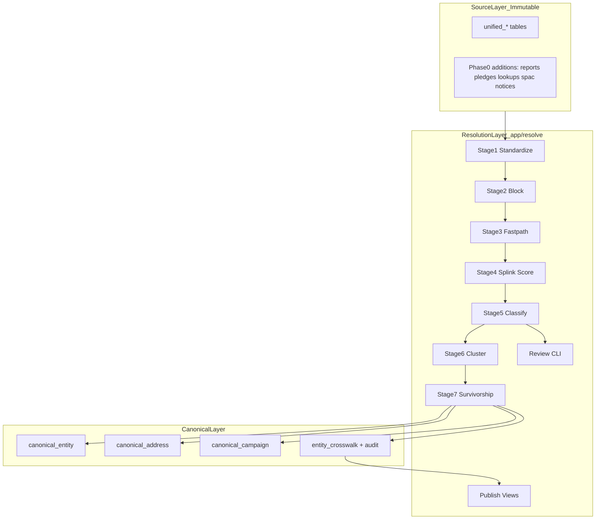

# Data Resolution Pipeline — Wave Orchestration Plan

## Current state

| Layer | Status |
|-------|--------|
| **Prerequisite — State Data CLI** | Done ([`app/cli/`](app/cli/), `cf prepare texas`) |
| **Phase 0 — Source layer** | **Likely complete** — models, registry, loader glob, and unit tests exist under [`app/core/source_models/`](app/core/source_models/), [`scripts/loaders/`](scripts/loaders/), [`tests/resolve/`](tests/resolve/) |
| **Phases 1–4 — Resolution pipeline** | **Not started** — no [`app/resolve/`](app/resolve/) package yet |

**Wave 0** treats Phase 0 as a verification gate, not a greenfield rebuild. If `uv run pytest tests/resolve/` is green and a full Texas load meets `task-0z` acceptance criteria, proceed directly to Wave 1. If not, re-dispatch only the failing `0a`–`0f` tasks from [`prompts/data-resolution-pipeline/phase-0-source-layer/`](prompts/data-resolution-pipeline/phase-0-source-layer/).

**Authoritative sources:**
- Design spec: [`docs/superpowers/specs/2026-05-23-data-resolution-pipeline-design.md`](docs/superpowers/specs/2026-05-23-data-resolution-pipeline-design.md)
- Task briefs: [`prompts/data-resolution-pipeline/`](prompts/data-resolution-pipeline/) — hand each agent the **entire** `task-*.md` file
- Pack README collision protocol: parallel tasks create **new files only**; `*z` tasks own registries, `__init__.py`, and cross-task wiring

## Architecture (target end state)



## Global rules (every wave)

1. **Branch naming:** `resolve/phase-<N>/task-<Nx>-<slug>` per parallel task; merge to `resolve/phase-<N>` before `*z`.
2. **Agent brief:** One agent = one `task-*.md` file. No agent edits files owned by another agent in the same wave.
3. **TDD:** Failing test → implement → green → one commit per step (Conventional Commits).
4. **Tests:** All new resolve tests under [`tests/resolve/`](tests/resolve/); run `uv run pytest tests/resolve/`.
5. **GitNexus (required):**
   - Before editing any symbol: run upstream `impact` on the target; warn user on **HIGH/CRITICAL** risk.
   - Before each `*z` merge commit: run `detect_changes` on staged files; confirm blast radius matches intent.
6. **Shared-file exceptions** (only one agent per wave may touch):
   - Phase 0: `unified_sqlmodels.py` (0a), loader scripts (0f), `source_models/__init__.py` (0z)
   - Phase 1: `pyproject.toml` if adding deps (likely 1c for usaddress stack)
   - Phase 2: `pyproject.toml` / `uv.lock` (2a adds splink + duckdb)
   - Phase 2: `survivorship.py` (2d only, round 2)
7. **Data prerequisite before Phase 1 integration:** `uv run cf prepare texas` then full load via [`scripts/loaders/production_loader.py`](scripts/loaders/production_loader.py).

---

## Wave dependency graph

```mermaid
flowchart LR
  W0[Wave0 Phase0 Gate]
  W1[Wave1 Phase1 R1]
  W2[Wave2 Phase1 R2]
  W3[Wave3 Phase1 1z]
  W4[Wave4 Phase2 R1]
  W5[Wave5 Phase2 2d]
  W6[Wave6 Phase2 2z]
  W7[Wave7 Phase3 R1]
  W8[Wave8 Phase3 3z]
  W9[Wave9 Phase4 R1]
  W10[Wave10 Phase4 4z]
  W0 --> W1 --> W2 --> W3 --> W4 --> W5 --> W6 --> W7 --> W8 --> W9 --> W10
```



**Total agents if Phase 0 passes gate:** 6 parallel + 10 serial integrations + 21 parallel implementation tasks ≈ **37 agent runs** (fewer if Phase 0 needs no rework).

---

## Wave 0 — Phase 0 verification gate

**Exec mode:** sequential (single agent)  
**Model:** claude-sonnet-4-6 — integration verification + loader reconciliation  
**Est. tokens:** ~50K

**Agent brief:** [`task-0z-integration.md`](prompts/data-resolution-pipeline/phase-0-source-layer/task-0z-integration.md)

**Actions:**
1. Run `uv run pytest tests/resolve/ -v`
2. Run full Texas load; confirm non-zero rows in all Phase 0 tables
3. Run transaction → report reconciliation (declared totals vs summed transactions within tolerance)
4. If any check fails, identify failing task (`0a`–`0f`) and dispatch **only that task** before re-running 0z

**Done when:** Phase 0 acceptance criteria in `task-0z` pass; branch merged to main (or `resolve/phase-0`).

---

## Wave 1 — Phase 1 Round 1 (3 parallel agents)

**Gate:** Wave 0 complete.

| Task ID | Title | Exec mode | Model | Model rationale | Est. tokens | Brief |
|---------|-------|-----------|-------|-----------------|-------------|-------|
| TASK-1a | Canonical schema | parallel | claude-sonnet-4-6 | SQLModel schema + enum design | ~50K | [`task-1a-canonical-schema.md`](prompts/data-resolution-pipeline/phase-1-foundation/task-1a-canonical-schema.md) |
| TASK-1b | Resolution schema | parallel | claude-sonnet-4-6 | Crosswalk + audit tables | ~50K | [`task-1b-resolution-schema.md`](prompts/data-resolution-pipeline/phase-1-foundation/task-1b-resolution-schema.md) |
| TASK-1c | Standardizers + stage 1 | parallel | gpt-5-3-codex | Polars feature-prep throughput | ~50K | [`task-1c-standardizers.md`](prompts/data-resolution-pipeline/phase-1-foundation/task-1c-standardizers.md) |

**GitNexus:** Run `impact` on `UnifiedTransaction`, `UnifiedPerson`, loader entry points before 1c touches ingest-adjacent helpers.

**Deliverables:** [`app/resolve/models/canonical.py`](app/resolve/models/canonical.py), [`app/resolve/models/resolution.py`](app/resolve/models/resolution.py), [`app/resolve/standardize/`](app/resolve/standardize/) package.

---

## Wave 2 — Phase 1 Round 2 (4 parallel agents)

**Gate:** Wave 1 merged to `resolve/phase-1`.

| Task ID | Title | Exec mode | Model | Model rationale | Est. tokens | Brief |
|---------|-------|-----------|-------|-----------------|-------------|-------|
| TASK-1d | Resolve CLI + run orchestration | parallel | claude-sonnet-4-6 | Typer CLI + match_run lifecycle | ~50K | [`task-1d-resolve-cli.md`](prompts/data-resolution-pipeline/phase-1-foundation/task-1d-resolve-cli.md) |
| TASK-1e | Stage 2 — blocking | parallel | gpt-5-3-codex | Set-based blocking logic | ~50K | [`task-1e-blocking.md`](prompts/data-resolution-pipeline/phase-1-foundation/task-1e-blocking.md) |
| TASK-1f | Stage 3 — deterministic fast-path | parallel | gpt-5-3-codex | Rule engine + merge_edges | ~50K | [`task-1f-fastpath.md`](prompts/data-resolution-pipeline/phase-1-foundation/task-1f-fastpath.md) |
| TASK-1g | Stage 7 — survivorship + publish | parallel | claude-sonnet-4-6 | Clustering + golden record rules | ~50K | [`task-1g-survivorship.md`](prompts/data-resolution-pipeline/phase-1-foundation/task-1g-survivorship.md) |

**Staging contracts (must align):** `candidate_pairs` (1e), `merge_edges` (1f), `resolution_input` (1c), canonical staging swap (1g).

**Deliverables:** [`app/resolve/cli.py`](app/resolve/cli.py), [`app/resolve/run.py`](app/resolve/run.py), [`app/resolve/blocking.py`](app/resolve/blocking.py), [`app/resolve/stages/fastpath.py`](app/resolve/stages/fastpath.py), [`app/resolve/stages/survivorship.py`](app/resolve/stages/survivorship.py).

---

## Wave 3 — Phase 1 integration (1 agent)

**Exec mode:** sequential[after: TASK-1a, TASK-1b, TASK-1c, TASK-1d, TASK-1e, TASK-1f, TASK-1g]  
**Model:** claude-sonnet-4-6 — end-to-end wiring + idempotency proof  
**Est. tokens:** ~50K

**Agent brief:** [`task-1z-integration.md`](prompts/data-resolution-pipeline/phase-1-foundation/task-1z-integration.md)

**Key wiring:**

```
stage 1  build_resolution_input     (1c)
stage 2  run_blocking_stage         (1e)
stage 3  run_fastpath_stage         (1f)
stage 7  run_survivorship_stage     (1g)
```

**Creates:** `app/resolve/__init__.py`, `models/__init__.py`, `stages/__init__.py`, `standardize/__init__.py`, [`tests/resolve/test_phase1_integration.py`](tests/resolve/test_phase1_integration.py)

**Done when:** `uv run python -m app.resolve run --state texas` completes with `match_run.status=completed`, crosswalk populated, **idempotent** second run.

---

## Wave 4 — Phase 2 Round 1 (4 parallel agents)

**Gate:** Wave 3 merged.

| Task ID | Title | Exec mode | Model | Model rationale | Est. tokens | Brief |
|---------|-------|-----------|-------|-----------------|-------------|-------|
| TASK-2a | Splink scoring (stage 4) | parallel | claude-sonnet-4-6 | Splink + DuckDB + TF adjustment | ~200K | [`task-2a-splink-scoring.md`](prompts/data-resolution-pipeline/phase-2-probabilistic/task-2a-splink-scoring.md) |
| TASK-2b | Classification bands (stage 5) | parallel | gpt-5-3-codex | Threshold logic + merge_review insert | ~50K | [`task-2b-classification.md`](prompts/data-resolution-pipeline/phase-2-probabilistic/task-2b-classification.md) |
| TASK-2c | Clustering (stage 6) | parallel | gpt-5-3-codex | Connected components + mega-cluster guard | ~50K | [`task-2c-clustering.md`](prompts/data-resolution-pipeline/phase-2-probabilistic/task-2c-clustering.md) |
| TASK-2e | Golden-set harness | parallel | claude-sonnet-4-6 | Labeled fixtures + CI precision gate | ~50K | [`task-2e-golden-set.md`](prompts/data-resolution-pipeline/phase-2-probabilistic/task-2e-golden-set.md) |

**Inter-stage tables (parallel-safe because write/read is disjoint):**

| Table | Writer | Reader |
|-------|--------|--------|
| `scored_pairs` | 2a | 2b |
| `merge_edges` (probabilistic append) | 2b | 2c |
| `clusters` | 2c | 2d (next wave) |

**2a owns:** `uv add splink duckdb` — no other Phase 2 agent touches `pyproject.toml`.

---

## Wave 5 — Phase 2 Round 2 (1 agent)

**Exec mode:** sequential[after: Wave 4]  
**Model:** claude-sonnet-4-6 — survivorship consumes probabilistic clusters  
**Est. tokens:** ~50K

**Agent brief:** [`task-2d-survivorship-update.md`](prompts/data-resolution-pipeline/phase-2-probabilistic/task-2d-survivorship-update.md)

**Only editor of:** [`app/resolve/stages/survivorship.py`](app/resolve/stages/survivorship.py) in Phase 2.

---

## Wave 6 — Phase 2 integration (1 agent)

**Exec mode:** sequential[after: TASK-2a, TASK-2b, TASK-2c, TASK-2d, TASK-2e]  
**Model:** claude-sonnet-4-6 — full pipeline + golden-set gate  
**Est. tokens:** ~50K

**Agent brief:** [`task-2z-integration.md`](prompts/data-resolution-pipeline/phase-2-probabilistic/task-2z-integration.md)

**Wires stages 4→5→6 into CLI; sets starting thresholds in `match_run.config_json`.**

**Done when:** Full Texas run 1–7; `merge_review` populated; golden-set precision floor passes CI; no auto-published cluster exceeds mega-cluster cap.

---

## Wave 7 — Phase 3 Round 1 (3 parallel agents)

**Gate:** Wave 6 merged.

| Task ID | Title | Exec mode | Model | Model rationale | Est. tokens | Brief |
|---------|-------|-----------|-------|-----------------|-------------|-------|
| TASK-3a | Review CLI + queue lifecycle | parallel | claude-sonnet-4-6 | Human workflow CLI | ~50K | [`task-3a-review-cli.md`](prompts/data-resolution-pipeline/phase-3-review-audit/task-3a-review-cli.md) |
| TASK-3b | Match explanation reports | parallel | gpt-5-3-codex | Renders Splink breakdown | ~50K | [`task-3b-explanation-reports.md`](prompts/data-resolution-pipeline/phase-3-review-audit/task-3b-explanation-reports.md) |
| TASK-3c | Reversibility / unmerge | parallel | claude-sonnet-4-6 | Run rollback + durable audit | ~50K | [`task-3c-reversibility.md`](prompts/data-resolution-pipeline/phase-3-review-audit/task-3c-reversibility.md) |

**Deliverables:** [`app/resolve/review/`](app/resolve/review/), [`app/resolve/reverse.py`](app/resolve/reverse.py), [`tests/resolve/test_reversibility.py`](tests/resolve/test_reversibility.py).

---

## Wave 8 — Phase 3 integration (1 agent)

**Exec mode:** sequential[after: TASK-3a, TASK-3b, TASK-3c]  
**Model:** claude-sonnet-4-6 — review→rerun feedback loop proof  
**Est. tokens:** ~50K

**Agent brief:** [`task-3z-integration.md`](prompts/data-resolution-pipeline/phase-3-review-audit/task-3z-integration.md)

**Verifies:** Approved review pairs merge on next run; rejected pairs never re-queued; unmerge restores prior graph.

---

## Wave 9 — Phase 4 Round 1 (4 parallel agents)

**Gate:** Wave 8 merged.

| Task ID | Title | Exec mode | Model | Model rationale | Est. tokens | Brief |
|---------|-------|-----------|-------|-----------------|-------------|-------|
| TASK-4a | Resolved views / fact tables | parallel | gpt-5-3-codex | SQL view builders | ~50K | [`task-4a-resolved-views.md`](prompts/data-resolution-pipeline/phase-4-publish/task-4a-resolved-views.md) |
| TASK-4b | address_occupancy view | parallel | gpt-5-3-codex | Address hub analytics | ~50K | [`task-4b-address-occupancy.md`](prompts/data-resolution-pipeline/phase-4-publish/task-4b-address-occupancy.md) |
| TASK-4c | co_located_with associations | parallel | claude-sonnet-4-6 | Link-without-merge pattern | ~50K | [`task-4c-colocation.md`](prompts/data-resolution-pipeline/phase-4-publish/task-4c-colocation.md) |
| TASK-4d | Cross-state hook (doc only) | parallel | claude-haiku-4-5 | Small verification + docs | <10K | [`task-4d-crossstate-hook.md`](prompts/data-resolution-pipeline/phase-4-publish/task-4d-crossstate-hook.md) |

**Deliverables:** [`app/resolve/publish/`](app/resolve/publish/) — four disjoint modules; **no cross-state resolution logic** in 4d.

---

## Wave 10 — Phase 4 integration (1 agent)

**Exec mode:** sequential[after: TASK-4a, TASK-4b, TASK-4c, TASK-4d]  
**Model:** claude-sonnet-4-6 — publish CLI + ERD update  
**Est. tokens:** ~50K

**Agent brief:** [`task-4z-integration.md`](prompts/data-resolution-pipeline/phase-4-publish/task-4z-integration.md)

**Creates:** `app/resolve/publish/__init__.py`; wires publish subcommand; updates [`docs/DATA_RELATIONSHIPS.md`](docs/DATA_RELATIONSHIPS.md).

**Done when:** Resolved views return canonical-entity joins; `address_occupancy` lists co-resident entities; full `tests/resolve/` green.

---

## Dispatch playbook (how to run each wave)

1. **Open wave** — create/checkout `resolve/phase-<N>` branch.
2. **Spawn N agents** — one per parallel task; attach the full `task-*.md` plus links to spec + phase README.
3. **Wait for all PRs/branches** — resolve merge conflicts only in `*z` if possible.
4. **Run integration agent** — `*z` task merges parallel work, wires registries, runs E2E tests.
5. **Gate check** — `uv run pytest tests/resolve/` + phase-specific acceptance (see each `task-*z`).
6. **GitNexus `detect_changes`** on staged integration merge.
7. **Merge phase branch** — advance to next wave.

**Recommended concurrency:** Up to 6 agents (Wave 1 re-work if Phase 0 fails); typically 3–4 agents per wave for Phases 1–4.

---

## Final Definition of Done (all phases)

- [ ] All `tmp/texas` record types loaded; transactions linked to reports (Phase 0)
- [ ] `uv run python -m app.resolve run --state texas` — full 7-stage pipeline (Phases 1–2)
- [ ] Review CLI: list / approve / reject / explain (Phase 3)
- [ ] Unmerge restores prior canonical graph (Phase 3)
- [ ] Published views queryable by canonical entity (Phase 4)
- [ ] `uv run pytest tests/resolve/` green including golden-set precision + reversibility
- [ ] `uv run ruff check . --fix && uv run ruff format .` on touched files
- [ ] No mutations to `unified_*` source rows from resolution code

## Risk notes

- **Phase 0 skip risk:** Code exists but full-load reconciliation may not have been run on current `tmp/texas` — Wave 0 must not be skipped without pytest + load verification.
- **2a token budget:** Splink integration is the highest-complexity task (~200K); assign the strongest model and avoid parallel edits to `survivorship.py`.
- **Staging table drift:** If round-2 agents start before round-1 interfaces land, enforce the phase README contracts (`candidate_pairs`, `scored_pairs`, `merge_edges`, `clusters`) — do not import across parallel tasks.
- **Determinism:** Fixed random seeds + `config_json` snapshot required for idempotency tests in 1z and 2z.
- **Out of scope (by design):** Cross-state entity linking logic; geocoding; public review UI.
