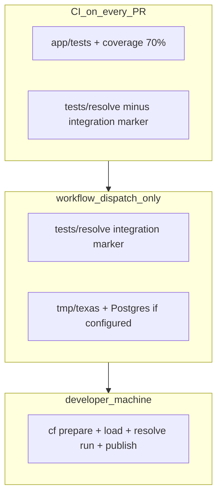
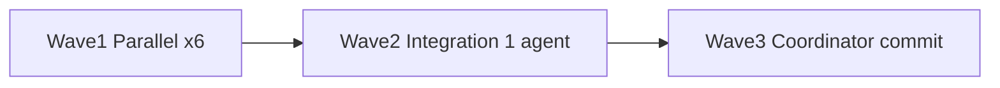

# Resolution Pipeline Review — Parallel Fix Plan

## Goal

Make the data-resolution pipeline **reproducible in CI** and **aligned with prompt acceptance**, without redesigning stages. Fixes map 1:1 to the [review findings](.cursor/plans/data_resolution_waves_d3596502.plan.md): CI gap, golden fixtures, Phase 0 reconciliation gate, docs/plan drift, optional CLI polish, and uncommitted Wave 10 artifacts.

## Architecture (test tiers)



**User choice (confirmed):** PR CI runs fast resolve tests only; integration/E2E is RUNBOOK + optional manual dispatch — not a PR blocker.

---

## Wave dependency graph



---

## Wave 1 — Parallel workers (6 agents, no shared writes)

Dispatch **one multitask batch** with six agents. Each agent gets its full task brief below; **create/modify ONLY listed files**.

### TASK-1 — Track golden fixtures in git

| Field | Value |
|-------|-------|
| **Exec mode** | parallel |
| **Model** | claude-haiku-4-5 |
| **Model rationale** | Small `.gitignore` + file-add change |
| **Est. tokens** | &lt;10K |

**Problem:** [`tests/resolve/golden/*.csv`](tests/resolve/golden/) exist locally but are ignored by [`*.csv`](.gitignore) (lines 2 and 182); task **2e** / CI clones fail.

**Files (only):**
- [`.gitignore`](.gitignore) — add negation rules after global `*.csv`:
  - `!tests/resolve/golden/`
  - `!tests/resolve/golden/*.csv`
- [`tests/resolve/golden/person_pairs.csv`](tests/resolve/golden/person_pairs.csv), `organization_pairs.csv`, `committee_pairs.csv` — `git add` (force if needed)
- [`tests/resolve/golden/README.md`](tests/resolve/golden/README.md) — note that fixtures are versioned and required for CI

**Acceptance:**
- `git check-ignore -v tests/resolve/golden/person_pairs.csv` returns nothing
- `uv run pytest tests/resolve/test_match_quality.py -q` passes on a clean clone

---

### TASK-2 — Phase 0 reconciliation test (no `tmp/texas`)

| Field | Value |
|-------|-------|
| **Exec mode** | parallel |
| **Model** | claude-sonnet-4-6 |
| **Model rationale** | SQLModel seeding + `reconcile_report_totals` contract |
| **Est. tokens** | ~50K |

**Problem:** task **0z** requires reconciliation logging; only registry smoke exists in [`test_phase0_integration.py`](tests/resolve/test_phase0_integration.py).

**Files (only):**
- **Create** [`tests/resolve/test_phase0_reconciliation.py`](tests/resolve/test_phase0_reconciliation.py)

**Implementation sketch:**
- In-memory SQLite using existing [`tests/resolve/conftest.py`](tests/resolve/conftest.py) stubs where possible, or minimal `UnifiedReport` / `UnifiedTransaction` tables
- Seed: one report with declared totals, linked transactions that **match** and one that **mismatch** beyond tolerance
- Call [`reconcile_report_totals`](app/core/source_models/reports_ingest.py) from `app.core.source_models`
- Assert returned dict keys `checked`, `matched`, `mismatched`, `skipped` and counts (no full Texas load)

**Do not touch:** `production_loader.py`, `conftest.py`, CI workflows.

---

### TASK-3 — New CI job for resolve tests (no coverage gate)

| Field | Value |
|-------|-------|
| **Exec mode** | parallel |
| **Model** | gpt-5-3-codex |
| **Model rationale** | Workflow YAML, fast one-shot |
| **Est. tokens** | ~50K |

**Problem:** [`.github/workflows/ci-tests.yml`](.github/workflows/ci-tests.yml) runs only `app/tests`; resolve suite is ungated.

**Files (only):**
- **Create** [`.github/workflows/ci-resolve-tests.yml`](.github/workflows/ci-resolve-tests.yml) — reusable `workflow_call` job:
  - `uv sync`
  - `uv run pytest tests/resolve -m "not integration" -v --tb=short` (marker registered in Wave 2; until then, run full `tests/resolve` and document temporary)
  - `PYTHONPATH: .`
  - Matrix: Python 3.12 only (or 3.12+3.13 if fast enough — prefer 3.12 only to save minutes)
- **Modify** [`.github/workflows/ci.yml`](.github/workflows/ci.yml) — add job `resolve-tests` calling the new workflow; include in `report` needs if desired

**Do not:** change `--cov-fail-under=70` on existing `app/tests` job (resolve tests must not dilute/break app coverage).

**Acceptance:** PR workflow runs resolve tests and fails if `tests/resolve` regresses.

---

### TASK-4 — Docs: CI, manual E2E gate, plan freshness

| Field | Value |
|-------|-------|
| **Exec mode** | parallel |
| **Model** | claude-haiku-4-5 |
| **Model rationale** | Documentation-only |
| **Est. tokens** | ~50K |

**Files (only):**
- [`docs/TESTING.md`](docs/TESTING.md) — update “What CI runs” table with `ci-resolve-tests.yml`; document `integration` marker and `uv run pytest tests/resolve -m "not integration"`
- [`docs/RUNBOOK.md`](docs/RUNBOOK.md) — add **Phase 0 / resolution manual gate** section:
  1. `uv run cf prepare texas`
  2. `uv run python scripts/loaders/production_loader.py` (state dir)
  3. Confirm Phase 0 table row counts + `report_id` linkage
  4. `uv run python -m app.resolve run --state texas`
  5. `uv run python -m app.resolve publish --state texas`
  6. Optional: `uv run pytest tests/resolve -m integration`
- [`.cursor/plans/data_resolution_waves_d3596502.plan.md`](.cursor/plans/data_resolution_waves_d3596502.plan.md) — fix stale “Phases 1–4 not started”; check Final DoD boxes that are now satisfied vs **manual-only**

**Do not touch:** `app/`, `tests/` (except plan path above).

---

### TASK-5 — `review report` CLI (task 3b gap)

| Field | Value |
|-------|-------|
| **Exec mode** | parallel |
| **Model** | gpt-5-3-codex |
| **Model rationale** | Small Typer/argparse subcommand wiring |
| **Est. tokens** | &lt;10K |

**Problem:** [`run_report`](app/resolve/review/explain.py) exists but is not exposed on CLI.

**Files (only):**
- [`app/resolve/cli.py`](app/resolve/cli.py) — under `review` subparser, add `report` with `--run-id`, optional `--band`
- **Create** [`tests/resolve/test_review_report_cli.py`](tests/resolve/test_review_report_cli.py) — invoke `run_report` path via CLI helper or subprocess `python -m app.resolve review report ...` with SQLite fixture

**Do not touch:** `review/explain.py` unless signature mismatch.

---

### TASK-6 — Align test filename with task 4d brief

| Field | Value |
|-------|-------|
| **Exec mode** | parallel |
| **Model** | claude-haiku-4-5 |
| **Model rationale** | Rename-only |
| **Est. tokens** | &lt;10K |

**Files (only):**
- Rename [`tests/resolve/test_crossstate.py`](tests/resolve/test_crossstate.py) → `test_crossstate_hook.py` (update any imports/docs references if present)

---

## Wave 2 — Integration agent (1 agent, sequential after Wave 1)

### TASK-7 — Pytest markers + integration E2E stubs + optional dispatch workflow

| Field | Value |
|-------|-------|
| **Exec mode** | sequential[after: TASK-1, TASK-2, TASK-3, TASK-4, TASK-5, TASK-6] |
| **Model** | claude-sonnet-4-6 |
| **Model rationale** | Owns shared `pyproject.toml`, `conftest.py`, wires CI marker |
| **Est. tokens** | ~50K |

**Files (only):**
- [`pyproject.toml`](pyproject.toml) — add `[tool.pytest.ini_options]`:
  ```toml
  markers = [
    "integration: requires tmp/texas and/or Postgres; excluded from default CI",
  ]
  ```
- [`tests/resolve/conftest.py`](tests/resolve/conftest.py) — `pytest_configure` or fixture documenting skip; optional `skip_integration` autouse for env checks
- **Create** [`tests/resolve/test_e2e_integration.py`](tests/resolve/test_e2e_integration.py) — all tests `@pytest.mark.integration`:
  - Skip unless `tmp/texas` exists **and** `postgres_env_configured()` (reuse helpers from [`app/resolve/cli.py`](app/resolve/cli.py) or duplicate minimal check in conftest)
  - Smoke: `discover_state_files("texas")` count &gt; 0
  - Smoke: `python -m app.resolve run --state texas --sqlite` **or** Postgres if env set (pick one documented path; prefer Postgres only when `DATABASE_URL` present)
- **Create** [`.github/workflows/ci-resolve-integration.yml`](.github/workflows/ci-resolve-integration.yml) — `workflow_dispatch` only; runs `pytest tests/resolve -m integration`
- **Modify** [`.github/workflows/ci-resolve-tests.yml`](.github/workflows/ci-resolve-tests.yml) — ensure `-m "not integration"` once markers land

**Acceptance:**
- `uv run pytest tests/resolve -m "not integration"` green in CI
- `uv run pytest tests/resolve -m integration` skips cleanly without data
- Full `uv run pytest tests/resolve` still green locally when golden CSVs present

**Optional (same agent, if time):** narrow `datetime.utcnow` → `datetime.now(timezone.utc)` in [`tests/resolve/conftest.py`](tests/resolve/conftest.py) stub only (reduces warning noise in resolve CI).

---

## Wave 3 — Coordinator (human or single agent, sequential)

### TASK-8 — Merge, verify, commit Wave 10 artifacts

| Field | Value |
|-------|-------|
| **Exec mode** | sequential[after: TASK-7] |
| **Model** | claude-sonnet-4-6 |
| **Model rationale** | GitButler merge + gate commands |
| **Est. tokens** | &lt;10K |

**Actions (no parallel agents):**
1. Merge all Wave 1–2 branches to phase branch via GitButler (`but`)
2. Run gates:
   - `uv run pytest tests/resolve -m "not integration"`
   - `uv run pytest app/tests` (unchanged coverage job)
   - `uv run ruff check app/resolve/ tests/resolve/`
   - GitNexus `detect_changes` on staged scope
3. Commit previously uncommitted Wave 10 files if still present:
   - [`app/resolve/publish/__init__.py`](app/resolve/publish/__init__.py)
   - [`tests/resolve/test_phase4_integration.py`](tests/resolve/test_phase4_integration.py)
   - [`docs/DATA_RELATIONSHIPS.md`](docs/DATA_RELATIONSHIPS.md)
   - [`app/resolve/cli.py`](app/resolve/cli.py) publish wiring
4. One conventional commit per logical slice (or one integration commit per team norm)

---

## Parallel-safety matrix

| File / resource | Owner |
|-----------------|--------|
| `.gitignore` + golden CSVs | TASK-1 only |
| `test_phase0_reconciliation.py` | TASK-2 only |
| `.github/workflows/ci-resolve-tests.yml`, `ci.yml` | TASK-3 only |
| `docs/TESTING.md`, `RUNBOOK.md`, plan `.md` | TASK-4 only |
| `cli.py` (review report only) | TASK-5 only |
| `test_crossstate_hook.py` rename | TASK-6 only |
| `pyproject.toml`, `conftest.py`, `test_e2e_integration.py`, `ci-resolve-integration.yml` | TASK-7 only |
| Git merge / commits | TASK-8 only |

**Never in parallel:** two agents editing [`app/resolve/cli.py`](app/resolve/cli.py), [`tests/resolve/conftest.py`](tests/resolve/conftest.py), or [`.github/workflows/ci.yml`](.github/workflows/ci.yml).

---

## Dispatch playbook

1. Open branch `resolve/review-fixes` (GitButler virtual branch).
2. Spawn **6 agents in one multitask batch** (TASK-1 … TASK-6) with full briefs copied from this plan.
3. Wait for all six; resolve conflicts only if an agent violated file ownership.
4. Spawn **TASK-7** with outputs from Wave 1 (especially TASK-3 workflow path).
5. Run **TASK-8** coordinator gates.
6. Re-run `/review` on the branch; loop only if new findings appear.

---

## Out of scope (by design)

- Cross-state matching implementation
- Replacing SQLite fixture integration tests with mandatory PR Postgres
- Broad `datetime.utcnow` cleanup across entire `app/` (optional follow-up)
- Changing Splink thresholds or stage logic

---

## Definition of done (post-fix)

- [ ] CI runs `tests/resolve` on every PR (excluding `integration`)
- [ ] Golden CSVs tracked in git; clone passes `test_match_quality.py`
- [ ] Phase 0 reconciliation covered by automated test (no `tmp/texas` required)
- [ ] RUNBOOK documents manual Texas + resolve E2E gate
- [ ] Plan doc reflects implemented state
- [ ] Wave 10 files committed
- [ ] `uv run pytest tests/resolve` green locally; GitNexus `detect_changes` clean
