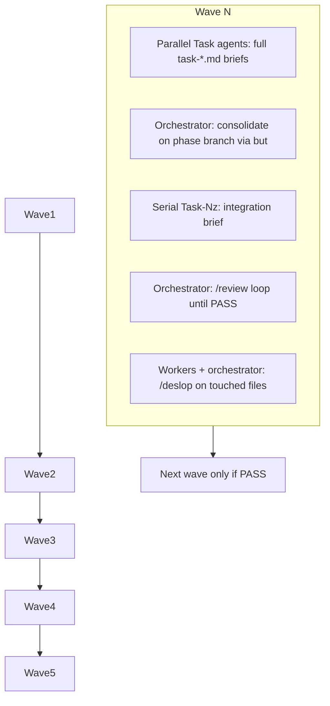
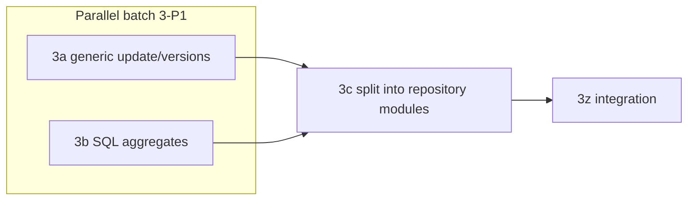

# Review Remediation Run 2 — Wave Orchestration Plan

## Scope and baseline

**Pack:** [prompts/review-remediation-run2/README.md](prompts/review-remediation-run2/README.md) — 5 waves, 17 parallel tasks + 5 integration tasks, 36 backlog rows, target overall score ≥ 8.0.

**Do not edit** [.cursor/plans/review_remediation_waves_1d9dad56.plan.md](.cursor/plans/review_remediation_waves_1d9dad56.plan.md) during execution.

**Keep green:** Resolve pipeline jobs (`tests/resolve -m "not integration"`), existing CI workflows. Run 2 must not regress `app/resolve/`.

**Verified still open on `gitbutler/workspace`:**

| Signal | Status |
|--------|--------|
| [ok_validation_funcs.py](app/states/oklahoma/funcs/ok_validation_funcs.py) | Present (1b crash risk) |
| [processor.py](app/core/processor.py) `self.builders` cache | Present (2a) |
| [op.py](app/op.py) `asyncio.run` in `__init__` | Present (2c) |
| [unified_database.py](app/core/unified_database.py) | 1,444 LOC (3a–3c) |
| [pyproject.toml](pyproject.toml) `fail_under = 60` | Mismatch vs CI 70 (1a; 5c raises to 80) |
| `dependency-scan.yml` | Appears fixed locally; 1a still aligns `pyproject.toml` |

**Round 1 overlap:** [.cursor/plans/review_remediation_waves_1d9dad56.plan.md](.cursor/plans/review_remediation_waves_1d9dad56.plan.md) may still be mid–Wave 3 on `remediation/review-fixes`. **Wave 0** must reconcile via GitButler (`but status -fv`) before starting Run 2: either stack `remediation-r3` on the active remediation virtual branch or start a new stacked branch from `main` — do not run two remediation packs on conflicting files without a human call.

---

## GitButler workflow (required)

All branching/commits use **`but`**, not raw `git checkout` / `git merge` / `git commit` ([AGENTS.md](AGENTS.md), [gitbutler skill](file:///Users/johneakin/.claude/skills/gitbutler/SKILL.md)).



**Phase branch:** `remediation-r3` (stack target for all wave work).

**Per-task virtual branches** (from README): `remediation-r3/wave-N/task-Nx`.

**Wave 0 prep (orchestrator, serial):**

1. `but status -fv` — list virtual branches and unassigned changes.
2. `but branch new remediation-r3` (or stack on existing remediation branch if continuing).
3. `npx gitnexus analyze` if MCP warns index is stale.
4. Baseline gates:
   ```bash
   uv run pytest tests app/tests -x --tb=short --ignore=tests/resolve
   uv run pytest tests/resolve -m "not integration" -q
   uv run ruff check app/ tests/
   ```

---

## Agent protocol (every worker and integration agent)

Attach the **full** brief path (no summarization). Example opener:

```
Branch: remediation-r3/wave-1/task-1a-ci-scan
Read and execute ONLY: prompts/review-remediation-run2/wave-1-immediate/task-1a-ci-scan.md
Rules: edit ONLY files listed in the brief; stop if you need another task's file.
Git: use but only (but branch new, but commit ... --status-after).
Docs: use Context7 (resolve-library-id → query-docs) before SQLModel/Pydantic/asyncio changes.
Pre-edit: gitnexus_impact on symbols you modify.
End: pytest/ruff on owned scope; one conventional commit via but.
```

### Per-agent closing sequence (mandatory)

1. **Self `/review`** — read-only; prioritize bugs, regressions, security, missing tests. Use subagents when helpful:
   - [security-auditor](subagent) — `op.py`, PII/logging (5d), CI (1a)
   - [test-writer](subagent) — new behavior in 2a, 3a–3c, 5c
   - [pipeline-auditor](subagent) — loader performance (4a–4d)
   - [docs-researcher](subagent) or **Context7 MCP** — library API verification (not optional for Polars/SQLModel/Pydantic)
2. Fix **P1/P2** findings from self-review before handoff.
3. **`/deslop`** — diff vs phase branch; remove unnecessary comments, defensive try/except, `any` casts ([deslop skill](file:///Users/johneakin/.cursor/plugins/cache/cursor-public/cursor-team-kit/11ecc12a3ffc037b4ef3b64de2be449668e8afc7/skills/deslop/SKILL.md)).
4. `gitnexus_detect_changes({scope: "staged"})` before commit.

### Orchestrator after each wave

1. Merge parallel virtual branches into `remediation-r3` via GitButler (resolve conflicts only on ownership violations).
2. Run **serial** `task-Nz-integration.md` agent (owns cross-file wiring, greps, tags).
3. Run **global gates** (below).
4. Run **wave `/review`** (code-reviewer subagent or `/review` command) on full wave diff — **do not start Wave N+1 until PASS**.
5. If not PASS: partition findings by file ownership → fix agents → re-run `*z` if shared files changed → `/review` again.
6. Orchestrator **`/deslop`** on wave diff after PASS.
7. `npx gitnexus analyze` after wave commit.

### PASS criteria (orchestrator `/review` loop)

- No open **P1/P2** tied to current wave backlog rows in [README.md](prompts/review-remediation-run2/README.md)
- Wave `*z` grep/DoD checks pass
- `uv run pytest tests app/tests --ignore=tests/resolve` green
- `uv run pytest tests/resolve -m "not integration" -q` green
- `uv run ruff check app/ tests/` clean
- GitNexus `detect_changes` scope matches intended symbols

### Global verification (every wave)

```bash
uv run pytest tests app/tests -x --tb=short
uv run pytest tests/resolve -m "not integration" -q
uv run ruff check app/ tests/
```

Wave 5 adds: `uv run pytest tests/ --cov=app --cov-fail-under=80` and README master greps in [task-5z-integration.md](prompts/review-remediation-run2/wave-5-quality-infra/task-5z-integration.md).

---

## Wave 1 — Immediate (~4 parallel + 1z)

**Parallel multitask batch** (one background Task per brief, `run_in_background: true`):

| Task | Brief | Model | Rationale | Est. tokens |
|------|-------|-------|-----------|-------------|
| 1a | [task-1a-ci-scan.md](prompts/review-remediation-run2/wave-1-immediate/task-1a-ci-scan.md) | gpt-5-3-codex | YAML + toml alignment | &lt;10K |
| 1b | [task-1b-ok-validation-dead-code.md](prompts/review-remediation-run2/wave-1-immediate/task-1b-ok-validation-dead-code.md) | claude-sonnet-4-6 | Delete crash file + import sweep | ~50K |
| 1c | [task-1c-dead-code-cleanup.md](prompts/review-remediation-run2/wave-1-immediate/task-1c-dead-code-cleanup.md) | claude-haiku-4-5 | Comment blocks + typing cleanup | ~50K |
| 1d | [task-1d-quick-quality.md](prompts/review-remediation-run2/wave-1-immediate/task-1d-quick-quality.md) | claude-sonnet-4-6 | utcnow + bare except | ~50K |

**File ownership:** Disjoint (CI, OK funcs, TX/OK validators + `unified_database` imports, `spac.py` + ABCs) — **true parallel**.

**Serial:** [task-1z-integration.md](prompts/review-remediation-run2/wave-1-immediate/task-1z-integration.md) — **claude-sonnet-4-6**, ~50K. Tag `remediation-r3/wave-1-complete`.

**Pre-wave GitNexus:** `impact` on `ok_validation_funcs` importers if deleting file.

---

## Wave 2 — Singletons (~3 parallel + 2z)

| Task | Brief | Model | Rationale | Est. tokens |
|------|-------|-------|-----------|-------------|
| 2a | [task-2a-processor-singleton.md](prompts/review-remediation-run2/wave-2-singletons/task-2a-processor-singleton.md) | claude-sonnet-4-6 | Processor test isolation | ~50K |
| 2b | [task-2b-oklahoma-contribution-split.md](prompts/review-remediation-run2/wave-2-singletons/task-2b-oklahoma-contribution-split.md) | claude-sonnet-4-6 | Four-level OK model | ~50K |
| 2c | [task-2c-asyncio-fix.md](prompts/review-remediation-run2/wave-2-singletons/task-2c-asyncio-fix.md) | claude-sonnet-4-6 | Context7 for asyncio factory pattern | ~50K |

**Ownership:** `processor.py`, `ok_contribution.py`, `op.py` — **true parallel**.

**Pre-wave GitNexus:** `impact` upstream on `unified_sql_processor`, `get_builder`, `OnePasswordItem`.

**Serial:** [task-2z-integration.md](prompts/review-remediation-run2/wave-2-singletons/task-2z-integration.md).

---

## Wave 3 — God class (highest structural risk)

**File overlap warning:** 3a, 3b, and 3c all modify [unified_database.py](app/core/unified_database.py) (README “no duplicate files” is optimistic). Recommended execution:



| Task | Brief | Exec | Model | Est. tokens |
|------|-------|------|-------|-------------|
| 3a | [task-3a-generic-update-versions.md](prompts/review-remediation-run2/wave-3-god-class/task-3a-generic-update-versions.md) | parallel with 3b | claude-opus-4-6 | ~200K |
| 3b | [task-3b-analytics-sql-aggregates.md](prompts/review-remediation-run2/wave-3-god-class/task-3b-analytics-sql-aggregates.md) | parallel with 3a | claude-sonnet-4-6 | ~50K |
| 3c | [task-3c-split-database-manager.md](prompts/review-remediation-run2/wave-3-god-class/task-3c-split-database-manager.md) | **sequential after 3a+3b merge** | claude-opus-4-6 | ~200K |

**Pre-wave (mandatory):** `gitnexus_context` + `gitnexus_impact` on `UnifiedDatabaseManager`, `update_transaction`, `get_summary_statistics`. Use `gitnexus_rename` for any public symbol moves.

**Serial:** [task-3z-integration.md](prompts/review-remediation-run2/wave-3-god-class/task-3z-integration.md) — import smoke tests, `unified_database.py` &lt; 300 lines.

**Expect 2–3 orchestrator `/review` iterations** on this wave.

---

## Wave 4 — Performance (loader overlap)

**Overlap:** 4a, 4b, 4c, 4d all touch [unified_state_loader.py](app/core/unified_state_loader.py). [task-4z-integration.md](prompts/review-remediation-run2/wave-4-performance/task-4z-integration.md) specifies merge order: **4c → 4a** (address cache lives on `LoadContext`).

Recommended execution:

| Phase | Tasks | Notes |
|-------|-------|-------|
| 4-P1 parallel | 4b ([tables.py](app/core/models/tables.py) MONEY_TYPE) + 4d (field library + injection) | Minimal loader conflict if 4d is constructor-only |
| 4-P2 serial | 4c → LoadContext | Refactors loader to `ctx.*` |
| 4-P3 serial | 4a | Address cache + single `_resolve_state_record` on `ctx` |
| 4z | integration | Conflict resolution + greps |

| Task | Brief | Model | Est. tokens |
|------|-------|-------|-------------|
| 4a | [task-4a-address-cache-double-lookup.md](prompts/review-remediation-run2/wave-4-performance/task-4a-address-cache-double-lookup.md) | claude-sonnet-4-6 | ~50K |
| 4b | [task-4b-commit-money-type.md](prompts/review-remediation-run2/wave-4-performance/task-4b-commit-money-type.md) | claude-sonnet-4-6 | ~50K |
| 4c | [task-4c-load-context-dataclass.md](prompts/review-remediation-run2/wave-4-performance/task-4c-load-context-dataclass.md) | claude-opus-4-6 | ~200K |
| 4d | [task-4d-loader-injection.md](prompts/review-remediation-run2/wave-4-performance/task-4d-loader-injection.md) | claude-sonnet-4-6 | ~50K |

**Pre-wave GitNexus:** `impact` on `UnifiedStateLoader`, `process_records_batch`, `_persist_transaction_from_record`.

**Subagent:** pipeline-auditor on wave completion.

---

## Wave 5 — Quality and infra (~4 parallel + 5z)

| Task | Brief | Model | Est. tokens |
|------|-------|-------|-------------|
| 5a | [task-5a-validator-dry.md](prompts/review-remediation-run2/wave-5-quality-infra/task-5a-validator-dry.md) | claude-sonnet-4-6 | ~50K |
| 5b | [task-5b-code-smells.md](prompts/review-remediation-run2/wave-5-quality-infra/task-5b-code-smells.md) | claude-sonnet-4-6 | ~50K |
| 5c | [task-5c-property-tests-coverage.md](prompts/review-remediation-run2/wave-5-quality-infra/task-5c-property-tests-coverage.md) | claude-sonnet-4-6 | Hypothesis + 80% gate | ~50K |
| 5d | [task-5d-infra.md](prompts/review-remediation-run2/wave-5-quality-infra/task-5d-infra.md) | claude-sonnet-4-6 | Docker, Splink, scrapers, PII | ~50K |

**Ownership:** Mostly disjoint; watch `unified_database.py` / `unified_state_loader.py` dispatch dedup (5a) vs prior waves.

**Serial:** [task-5z-integration.md](prompts/review-remediation-run2/wave-5-quality-infra/task-5z-integration.md) — **claude-opus-4-6**, master README greps, write **`prompts/review-remediation-run2/COMPLETION.md`**, tag `remediation-r3/complete`.

**5d approval note:** Dockerfile/compose is new infra — confirm image entrypoint matches `uv run cf` / loader docs before merge ([docs/DEPLOYMENTS.md](docs/DEPLOYMENTS.md)).

---

## Orchestrator dispatch template (multitask batch)

For each wave’s parallel batch, launch in **one message** with `Task` + `run_in_background: true`:

- Attach full `prompts/review-remediation-run2/.../task-*.md`
- Set `subagent_type: generalPurpose` (or `explore` only for pre-read)
- Include model from tables above
- Wait for all agents → merge via `but` → run `*z` → gates → `/review` loop → `/deslop`

**Minimum agent runs:** 17 parallel + 5 integration + 5 orchestrator review loops ≈ **27**; budget **35–45** with Waves 3–4 iteration.

---

## Risk controls

| Risk | Mitigation |
|------|------------|
| Wave 3/4 merge conflicts | Sub-batch sequencing above; `*z` owns resolution |
| Round 1 vs Run 2 collision | Wave 0 GitButler branch audit |
| GitButler vs brief `git merge` | Briefs show raw git; **orchestrator translates to `but`** |
| Structural redesign | User rule: incremental only; describe before provider/architecture swaps |
| Index staleness | `gitnexus analyze` after each wave |
| Coverage jump 60→80 | Wave 5c + 5z; may need test additions in 5c before 5z PASS |

---

## Definition of done (entire pack)

- All rows in [README.md](prompts/review-remediation-run2/README.md) verified (5z master greps)
- [COMPLETION.md](prompts/review-remediation-run2/COMPLETION.md) written
- `uv run pytest tests/ --cov=app --cov-fail-under=80` green
- `uv run ruff check .` clean
- Final orchestrator `/review` PASS
- Optional: `but push` + PR from `remediation-r3`
