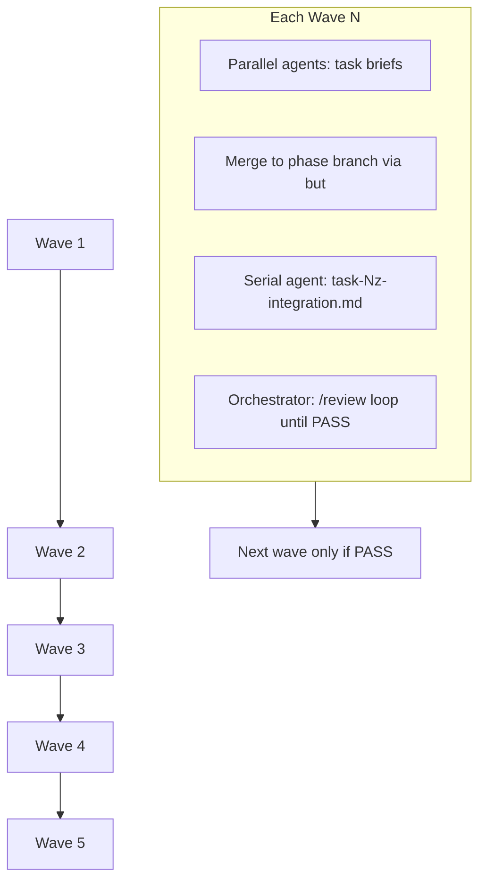

# Review Remediation — Full Wave Orchestration Plan

## Scope and baseline

**In scope:** Every row in [prompts/review-remediation/README.md](prompts/review-remediation/README.md) — all P1/P2/P3 code-review items, 18 `RF-*` issues, 12 `R#` risks. **Defer nothing.**

**Out of scope for this pack (already addressed on `gitbutler/workspace`):** The older [resolution_pipeline_fixes plan](.cursor/plans/resolution_pipeline_fixes_ea1848c8.plan.md) items (golden CSVs, `ci-resolve-tests.yml`, `test_phase0_reconciliation.py`, `review report` CLI, integration markers). Keep those jobs green; do not regress them.

**Current gaps (verified in tree):**

| Signal | Status |
|--------|--------|
| `text(f"` SQL in [unified_state_loader.py](app/core/unified_state_loader.py) | Still present (lines 394, 433, 439) |
| [postgres_config.py](app/states/postgres_config.py) | Missing |
| [app/main.py](app/main.py), [app/funcs/depreciated.py](app/funcs/depreciated.py) | Still present |
| [unified_sqlmodels.py](app/core/unified_sqlmodels.py) | 1856 LOC — unsplit |
| [ci-tests.yml](.github/workflows/ci-tests.yml) | Still `app/tests` only |
| `poetry.lock` | Still committed |
| Legacy `from abcs` imports | ~20 files |
| `asyncio.run` in [app/op.py](app/op.py) | Present (line 67) |

**Phase branch:** `remediation/review-fixes` (GitButler virtual branch). Workers use `remediation/wave-<N>/task-<id>-<slug>` per brief; merge into the phase branch before each `*z` integration.

---

## Orchestration model



### Orchestrator responsibilities (you, between waves)

1. **Dispatch** — One multitask batch per wave: attach the **full** `task-*.md` path (do not summarize). Enforce file ownership from each brief; workers must stop if they need a peer-owned file.
2. **Merge** — After all parallel agents finish: `but` merge virtual branches into `remediation/review-fixes`; resolve conflicts only on ownership violations.
3. **Integrate** — Run the wave’s `task-<N>z-integration.md` as a **single serial agent** (owns cross-file rewiring, `__init__.py`, repo-wide greps).
4. **Gate** — Run wave verification commands (below), then **`/review`** on the phase branch.
5. **Loop** — If `/review` is not PASS: partition findings by file ownership, spawn fix agents (same wave or hotfix sub-batch), re-merge, re-run `*z` if shared files changed, **`/review` again**. Do not start Wave N+1 until PASS.
6. **Advance** — Only after PASS: dispatch Wave N+1 parallel batch.

### PASS criteria for `/review` loop

- No open **P1** or **P2** findings tied to the current wave’s backlog rows
- Wave `*z` acceptance criteria met (full pytest + ruff for touched scope)
- No new regressions in `tests/resolve` fast tier (`-m "not integration"`)
- GitNexus `detect_changes` scope matches intended symbols (run before wave commit)

### Global verification commands (every wave)

```bash
uv run pytest tests app/tests -x --tb=short
uv run pytest tests/resolve -m "not integration" -q
uv run ruff check app/ tests/
```

Wave 5 adds coverage gate and residue greps from [task-5z-integration.md](prompts/review-remediation/wave-5-tests-ops/task-5z-integration.md).

---

## Wave 1 — Correctness, security, hygiene

**8 parallel agents → 1z integration → `/review` loop**

| Task ID | Brief | Exec | Model | Rationale | Est. tokens |
|---------|-------|------|-------|-----------|-------------|
| TASK-1a | [task-1a-postgres-config.md](prompts/review-remediation/wave-1-correctness/task-1a-postgres-config.md) | parallel | claude-haiku-4-5 | New pydantic-settings module | &lt;10K |
| TASK-1b | [task-1b-sql-injection.md](prompts/review-remediation/wave-1-correctness/task-1b-sql-injection.md) | parallel | claude-sonnet-4-6 | Parameterized SQL + new tests | ~50K |
| TASK-1c | [task-1c-custom-query-and-guard.md](prompts/review-remediation/wave-1-correctness/task-1c-custom-query-and-guard.md) | parallel | claude-sonnet-4-6 | Security guard + db_manager narrow | ~50K |
| TASK-1d | [task-1d-inert-postinit.md](prompts/review-remediation/wave-1-correctness/task-1d-inert-postinit.md) | parallel | claude-sonnet-4-6 | Pydantic validators across unified models | ~50K |
| TASK-1e | [task-1e-secret-hygiene.md](prompts/review-remediation/wave-1-correctness/task-1e-secret-hygiene.md) | parallel | gpt-5-3-codex | Focused `op.py` SecretStr / forbid extra | &lt;10K |
| TASK-1f | [task-1f-delete-dead-modules.md](prompts/review-remediation/wave-1-correctness/task-1f-delete-dead-modules.md) | parallel | claude-haiku-4-5 | Delete `main.py`, `depreciated.py` | &lt;10K |
| TASK-1g | [task-1g-texas-filers-deadcode.md](prompts/review-remediation/wave-1-correctness/task-1g-texas-filers-deadcode.md) | parallel | claude-sonnet-4-6 | Large dead-code strip + OK validator | ~50K |
| TASK-1h | [task-1h-ci-and-repo-hygiene.md](prompts/review-remediation/wave-1-correctness/task-1h-ci-and-repo-hygiene.md) | parallel | gpt-5-3-codex | CI YAML + dependabot + lockfile/DB | ~50K |

**TASK-1z** (serial after merge): [task-1z-integration.md](prompts/review-remediation/wave-1-correctness/task-1z-integration.md) — **claude-sonnet-4-6**, ~50K

- Repo-wide `ruff check --fix` (RF-DEAD-003)
- `ruff check --select UP007 --fix app/` for `Optional[X]` → `X | None`
- Confirm `grep -rn "asyncio\.run(" app/` has no hits inside `__init__` (fix in owning file if found)
- Verify Wave 1 backlog rows P1-OPS-001, P1-SEC-001/002/003, P1-ARC-001, RF-DEAD-001/002/003, P3-QUAL-002/003/005, P2-TEST-001 (CI part), R6/R7/R8

**1h coordination note:** Expand [ci-tests.yml](.github/workflows/ci-tests.yml) to `tests app/tests` without removing the existing `resolve-tests` job in [ci.yml](.github/workflows/ci.yml).

**Collision matrix (Wave 1):** Each task owns only its brief’s files; only **1z** may touch many files after merge.

---

## Wave 2 — Decouple the data layer

**3 parallel → 2z → `/review` loop**

| Task ID | Brief | Exec | Model | Rationale | Est. tokens |
|---------|-------|------|-------|-----------|-------------|
| TASK-2a | [task-2a-db-factory-and-injection.md](prompts/review-remediation/wave-2-decouple/task-2a-db-factory-and-injection.md) | parallel | claude-opus-4-6 | Factory + DI + circular import break | ~200K |
| TASK-2b | [task-2b-retire-dead-layer.md](prompts/review-remediation/wave-2-decouple/task-2b-retire-dead-layer.md) | parallel | claude-sonnet-4-6 | Delete `unified_models.py` dead paths | ~50K |
| TASK-2c | [task-2c-centralize-logging.md](prompts/review-remediation/wave-2-decouple/task-2c-centralize-logging.md) | parallel | claude-sonnet-4-6 | dictConfig + Logger cache | ~50K |

**TASK-2z:** [task-2z-integration.md](prompts/review-remediation/wave-2-decouple/task-2z-integration.md) — **claude-sonnet-4-6 (Max/1M)** if import sweep spans &gt;200 files, else sonnet-4-6 — ~200K

- Absolute `app.*` imports; delete [app/_path_setup.py](app/_path_setup.py)
- Backlog: P2-ARC-002, RF-SMELL-005, RF-SMELL-002 (dead layer), P2-OPS-002, P3-QUAL-004

**Pre-wave GitNexus:** Run `impact` upstream on `db_manager`, `UnifiedSQLModelBuilder` before 2a.

---

## Wave 3 — Split god-modules

**2 parallel → 3z → `/review` loop**

| Task ID | Brief | Exec | Model | Rationale | Est. tokens |
|---------|-------|------|-------|-----------|-------------|
| TASK-3a | [task-3a-split-god-module.md](prompts/review-remediation/wave-3-split/task-3a-split-god-module.md) | parallel | claude-sonnet-4-6 (Max/1M) | 1856-line split + constants/enums | &gt;200K |
| TASK-3b | [task-3b-texas-validator-mixin.md](prompts/review-remediation/wave-3-split/task-3b-texas-validator-mixin.md) | parallel | claude-sonnet-4-6 | TX mixin + OK DRY validators | ~50K |

**TASK-3z:** [task-3z-integration.md](prompts/review-remediation/wave-3-split/task-3z-integration.md) — **claude-sonnet-4-6** — ~50K

- Rewire all `unified_sqlmodels` importers; dedupe `production_loader.py` record-type frozenset
- Backlog: RF-SMELL-002 (split), RF-MAGIC-001/002/003, RF-DRY-003/004, R1

**Pre-wave GitNexus:** `context` + `impact` on `unified_sqlmodels` and `process_record` before 3a; use `gitnexus_rename` for any public symbol moves.

---

## Wave 4 — Core-path refactors

**5 parallel → 4z → `/review` loop**

| Task ID | Brief | Exec | Model | Rationale | Est. tokens |
|---------|-------|------|-------|-----------|-------------|
| TASK-4a | [task-4a-processor-refactor.md](prompts/review-remediation/wave-4-refactor/task-4a-processor-refactor.md) | parallel | claude-opus-4-6 | Registry + streaming + god `process_record` | ~200K |
| TASK-4b | [task-4b-version-helper.md](prompts/review-remediation/wave-4-refactor/task-4b-version-helper.md) | parallel | claude-sonnet-4-6 | Version snapshot + json-safe helper | ~50K |
| TASK-4c | [task-4c-n-plus-1-and-excepts.md](prompts/review-remediation/wave-4-refactor/task-4c-n-plus-1-and-excepts.md) | parallel | claude-sonnet-4-6 | Batch sessions + narrow excepts | ~50K |
| TASK-4d | [task-4d-value-objects.md](prompts/review-remediation/wave-4-refactor/task-4d-value-objects.md) | parallel | claude-sonnet-4-6 | PersonName, AddressParts, Officer | ~50K |
| TASK-4e | [task-4e-base-table-split.md](prompts/review-remediation/wave-4-refactor/task-4e-base-table-split.md) | parallel | claude-sonnet-4-6 | Validator Base/Create/Table split | ~50K |

**TASK-4z:** [task-4z-integration.md](prompts/review-remediation/wave-4-refactor/task-4z-integration.md) — **claude-sonnet-4-6** — ~50K

- Wire value objects into builders; confirm `pl.scan_*` / `process_record_stream` in loader
- Backlog: RF-DRY-001/002, RF-CPLX-001/003, RF-SMELL-003/004, P2-PERF-001/002, P2-MNT-001, P2-ARC-001, R11

**Wave 4 is highest regression risk** — expect 2–3 `/review` iterations; run characterization tests from 5a early if 4a/4c touch processor contracts.

---

## Wave 5 — Tests, ops, scrapers, docs

**4 parallel → 5z → final `/review` loop**

| Task ID | Brief | Exec | Model | Rationale | Est. tokens |
|---------|-------|------|-------|-----------|-------------|
| TASK-5a | [task-5a-core-tests.md](prompts/review-remediation/wave-5-tests-ops/task-5a-core-tests.md) | parallel | claude-sonnet-4-6 | Characterization + unit coverage | ~50K |
| TASK-5b | [task-5b-scraper-hardening.md](prompts/review-remediation/wave-5-tests-ops/task-5b-scraper-hardening.md) | parallel | claude-sonnet-4-6 | Markup drift + fixture tests (R2) | ~50K |
| TASK-5c | [task-5c-orchestration.md](prompts/review-remediation/wave-5-tests-ops/task-5c-orchestration.md) | parallel | claude-sonnet-4-6 | Scheduler + prod entrypoint (R9) | ~50K |
| TASK-5d | [task-5d-docs-and-adr.md](prompts/review-remediation/wave-5-tests-ops/task-5d-docs-and-adr.md) | parallel | claude-haiku-4-5 | ERD + ADR R3/R12 | ~50K |

**TASK-5z:** [task-5z-integration.md](prompts/review-remediation/wave-5-tests-ops/task-5z-integration.md) — **claude-opus-4-6** — ~200K

- Full backlog audit against README table
- Residue greps: `ic(`, `except Exception`, `text(f"`, `datetime.utcnow`, commented blocks
- Module/function size targets (~600 / ~50 LOC)
- E2E smoke via 5c entrypoint
- Write [prompts/review-remediation/COMPLETION.md](prompts/review-remediation/COMPLETION.md)

---

## Parallel dispatch template (orchestrator copy-paste)

For each parallel agent, prompt must include:

```
Branch: remediation/wave-<N>/task-<id>-<slug>
Read and execute ONLY: prompts/review-remediation/wave-<N>/.../task-<id>-....md
Rules: edit ONLY files listed in the brief; stop if you need another task's file.
End: ruff on owned files; pytest for suites you touched; one conventional commit.
Notion reports: URLs in pack README for finding detail.
```

**Never** edit [`.cursor/plans/resolution_pipeline_fixes_ea1848c8.plan.md`](.cursor/plans/resolution_pipeline_fixes_ea1848c8.plan.md) or plan todos during execution.

---

## Risk controls

| Risk | Mitigation |
|------|------------|
| Wave 3/4 blast radius | Mandatory GitNexus `impact` before 3a, 4a; `detect_changes` after each `*z` |
| CI false green during Wave 1 | 1h must run `tests/` before merge; orchestrator verifies CI YAML locally |
| Parallel collision on `cli.py` / `conftest.py` | Not in remediation parallel sets (resolve fixes already own those) |
| Review loop scope creep | Fix only findings mapped to current or prior wave backlog; structural redesigns need your approval per project rule |
| Index staleness | `npx gitnexus analyze` after each wave commit |

---

## Definition of done (entire pack)

All items in README “Full backlog” table verified in code; [COMPLETION.md](prompts/review-remediation/COMPLETION.md) written; `uv run pytest tests app/tests --cov=app --cov-fail-under=70` green; `uv run ruff check .` clean; residue greps empty in `app/`; final `/review` PASS; optional PR from `remediation/review-fixes` → `main`.

**Estimated effort:** 5 waves × (parallel batch + integration + 1–3 review loops) ≈ 27 agent runs minimum, 35–45 with review iterations on Waves 3–4.
