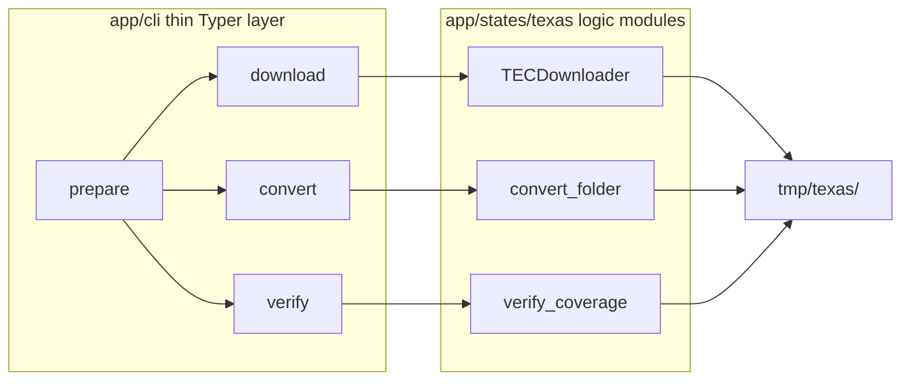

# State Data CLI (`cf`) — Full Implementation Plan

## Current state

Nothing from [prompts/state-data-cli/](prompts/state-data-cli/) is built yet:

| Component | Status |
|-----------|--------|
| [`app/cli/`](app/cli/) | Missing |
| [`app/states/texas/texas_converter.py`](app/states/texas/texas_converter.py) | Missing |
| [`app/states/texas/texas_coverage.py`](app/states/texas/texas_coverage.py) | Missing |
| [`app/states/texas/texas_downloader.py`](app/states/texas/texas_downloader.py) | Exists — interactive (`input()` in [`abc_download.py`](app/abcs/abc_download.py)), `icecream`, unbounded wait loop, returns `self` not `Path` |
| `typer` / `[project.scripts]` | Not in [`pyproject.toml`](pyproject.toml) |
| `tests/cli/` | Missing |

Downstream loaders (e.g. [`scripts/loaders/production_loader.py`](scripts/loaders/production_loader.py)) expect **parquet** under `tmp/texas` ([`StateConfig.TEMP_FOLDER`](app/abcs/abc_state_config.py) → `tmp/texas`). The CLI closes the gap: download CSVs → convert → verify before resolution/load.

## Target architecture



**Design rules (from pack):**
- CLI = argument parsing + `rich` rendering only; no business logic
- Logic modules log via [`app/logger.py`](app/logger.py); no `print()` in `app/`
- Lazy imports inside command functions (testable before A/B/C merge)
- TDD: failing test → implement → green → one commit per step

## Execution order

```
Round 1 (parallel):  task-A  task-B  task-C  task-D
Then (serial):       task-Z  integration
```

Each round-1 task uses branch `cli/task-<x>-<slug>`. Only **task D** edits `pyproject.toml`.

---

### TASK-1 — Task A: Downloader refactor

**Exec mode:** parallel  
**Model:** claude-sonnet-4-6 — Selenium refactor + mock-heavy tests  
**Est. tokens:** ~50K

**GitNexus:** Run upstream `impact` on `TECDownloader`, `FileDownloaderABC.check_if_folder_exists`, and `download` before editing.

**Files owned:**
- Modify: [`app/abcs/abc_download.py`](app/abcs/abc_download.py), [`app/states/texas/texas_downloader.py`](app/states/texas/texas_downloader.py)
- Modify if signature breaks: [`app/states/texas/__init__.py`](app/states/texas/__init__.py), [`app/main.py`](app/main.py) (callers are mostly commented; grep `.download(` / `read_from_temp` before merge)
- Create: `tests/cli/test_texas_downloader.py`

**Contract:**

```python
class DownloadError(Exception): ...

def download(*, overwrite: bool = False, headless: bool = False) -> Path
```

**Key changes (incremental, not a rewrite):**
1. Replace `check_if_folder_exists` prompt/`sys.exit` with `mkdir(parents=True, exist_ok=True)`
2. Update ABC abstract `download` signature to match keyword-only contract
3. Swap `ic(...)` → `Logger(__name__)` in touched files
4. Wire `headless=True` → `options.add_argument("--headless")`
5. Bound `.crdownload` poll loop (~10 min constant + sleep); timeout → `DownloadError`
6. Wrap Selenium/extraction failures in `DownloadError`; return `config.TEMP_FOLDER` on success
7. **Do not** change navigation, zip extraction, or date-suffix renaming

---

### TASK-2 — Task B: CSV → parquet converter

**Exec mode:** parallel  
**Model:** gpt-5-3-codex — focused Polars module  
**Est. tokens:** ~50K

**Files owned (new only):**
- [`app/states/texas/texas_converter.py`](app/states/texas/texas_converter.py)
- `tests/cli/test_texas_converter.py`

**Contract:**

```python
@dataclass
class ConvertResult:
    converted: int
    skipped: int
    failed: list[tuple[Path, str]]
    @property
    def ok(self) -> bool: ...  # failed empty

def convert_folder(folder, *, overwrite=False, keep_csv=True, on_progress=None) -> ConvertResult
```

**Implementation notes:**
- Glob `*.csv` and `*.txt`; write sibling `.parquet` via `pl.read_csv(...).write_parquet(...)`
- Encoding fallback: `utf-8` → `latin-1`/`cp1252`
- Per-file failures go to `failed`; run continues
- `on_progress(path)` called once per processed file

---

### TASK-3 — Task C: Coverage verifier

**Exec mode:** parallel  
**Model:** gpt-5-3-codex — dataclass + Polars row counts  
**Est. tokens:** ~50K

**Files owned (new only):**
- [`app/states/texas/texas_coverage.py`](app/states/texas/texas_coverage.py)
- `tests/cli/test_texas_coverage.py`

**Authoritative prefix map:** Confirm against [`tmp/texas/CFS-ReadMe.txt`](tmp/texas/CFS-ReadMe.txt) (present in repo). Fallback: inline map from [task-c-verifier.md](prompts/state-data-cli/task-c-verifier.md).

**Required types (minimum):** `RCPT`, `EXPN`, `LOAN`, `FILER`, `CVR1`

**Contract:**

```python
@dataclass
class CoverageRow:
    record_type: str
    files: list[Path]
    row_count: int
    status: Literal["present", "missing", "empty"]

@dataclass
class CoverageReport:
    rows: list[CoverageRow]
    @property
    def ok(self) -> bool: ...  # all required types present + non-empty
```

Glob `*.parquet`, group by prefix → record type, sum row counts with Polars.

---

### TASK-4 — Task D: `cf` Typer CLI package

**Exec mode:** parallel  
**Model:** claude-sonnet-4-6 — multi-command CLI + CliRunner tests  
**Est. tokens:** ~50K

**Files owned:**
- Create: `app/cli/__init__.py`, `__main__.py`, `main.py`, `state.py`, `download.py`, `convert.py`, `verify.py`, `prepare.py`
- Create: `tests/cli/test_commands.py`
- Modify: [`pyproject.toml`](pyproject.toml) — `uv add typer` + `[project.scripts] cf = "app.cli.main:app"`

**Commands:**

| Command | Options | Exit 1 when |
|---------|---------|-------------|
| `cf download texas` | `--overwrite/-o`, `--headless/--no-headless`, `--out PATH` | `DownloadError` |
| `cf convert texas` | `--overwrite`, `--keep-csv/--no-keep-csv` | `not result.ok` |
| `cf verify texas` | — | `not report.ok` |
| `cf prepare texas` | `--overwrite`, `--headless/--no-headless`, `--skip-download` | first failing stage |

**`state.py`:** `State(str, Enum)` with `texas`; `resolve_state()` → config + temp folder from `TEXAS_CONFIGURATION`.

**Testing:** Typer `CliRunner`; monkeypatch logic functions inside lazy-import targets. Root `--verbose/-v` raises log level.

---

### TASK-5 — Task Z: Integration + docs

**Exec mode:** sequential[after: TASK-1, TASK-2, TASK-3, TASK-4]  
**Model:** claude-sonnet-4-6 — contract verification + mocked E2E  
**Est. tokens:** ~50K

**After A–D merge:**
1. `uv sync`; confirm `cf --help`, `cf --version`, `python -m app.cli`
2. Verify lazy imports resolve real modules; fix any genuine signature mismatches (minimal edits only)
3. Create `tests/cli/test_prepare_integration.py`:
   - Mock `webdriver.Chrome`; seed temp folder with small fixture CSVs covering required types
   - `cf prepare texas` → parquet written, verify passes, exit 0
   - Missing required type → exit non-zero, message names **verify** stage
4. Run full `uv run pytest tests/cli/`
5. Add CLI section to [`README.md`](README.md) (currently empty): install, four commands, `cf prepare texas` example

**GitNexus:** Run `detect_changes` on staged files before final commit.

---

## Verification checklist (Definition of Done)

- [ ] `uv run pytest tests/cli/` green (unit + integration)
- [ ] `uv run cf --version` and `uv run python -m app.cli --help` work
- [ ] No `input()` / `sys.exit()` / `icecream` in download path
- [ ] `cf prepare texas` chains download → convert → verify (download mocked in CI)
- [ ] `uv run ruff check . --fix && uv run ruff format .` on touched files

## Risk notes

- **ABC signature change (task A):** Any code implementing `FileDownloaderABC.download(overwrite, read_from_temp)` must be updated; grep shows only Texas downloader + commented callers today.
- **Return type change:** `download()` currently returns `self`; CLI expects `Path` — update callers if any use the return value.
- **No live Selenium in tests:** All downloader/prepare tests patch `webdriver.Chrome`; never hit ethics.state.tx.us in CI.
- **Future commands:** Pack reserves `cf load` / `cf resolve` as natural extensions; out of scope here.

## Out of scope

- Resolution pipeline CLI (`app/resolve/cli.py` — separate prompt pack)
- Changes to Selenium navigation or zip renaming logic
- Loading data into Postgres (`scripts/loaders/`)
