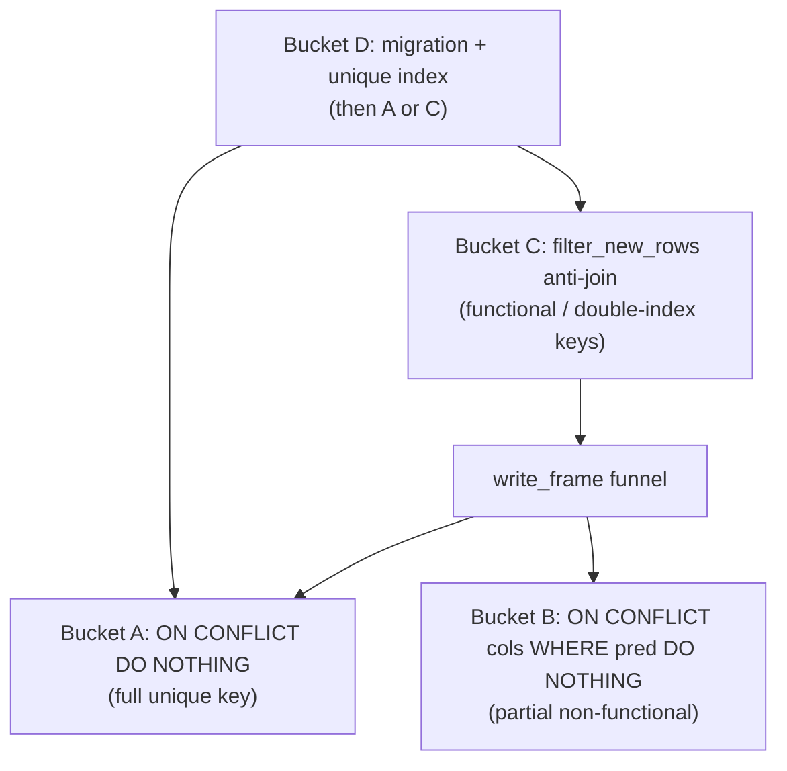
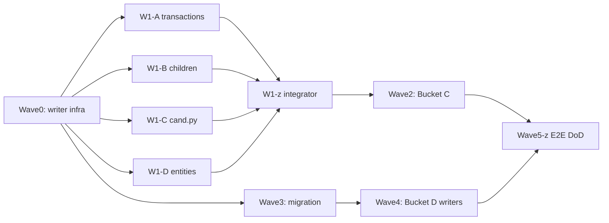

# Upsert All Records — Parallel Subagent Plan

**Goal:** Re-loading the same source adds zero rows and updates zero rows (first-write-wins), eliminating append-driven Postgres bloat.

**Spec sources (workers must receive full text, not summaries):**
- Brief: [`prompts/upsert-all-records/2026-06-20-upsert-all-records.md`](prompts/upsert-all-records/2026-06-20-upsert-all-records.md)
- Design matrix: [`docs/upsert-all-records-plan-2026-06-20.md`](docs/upsert-all-records-plan-2026-06-20.md)

**Current state:** Greenfield — all family writers still use `conflict_cols=None` (~25 call sites). [`app/core/upsert.py`](app/core/upsert.py) has no `conflict_where`. No `filter_new_rows`, no new idempotency tests, no dimension dedup migration.

**Architecture (four mechanisms, one rule):**



---

## Orchestrator setup (parent session only)

1. Create GitButler virtual branch: `but branch create upsert-all-records`
2. Run GitNexus impact (mandatory per [`CLAUDE.md`](CLAUDE.md)):
   - `gitnexus_impact({target: "write_frame", direction: "upstream"})`
   - `gitnexus_impact({target: "_write_frame_postgres", direction: "upstream"})`
   - Surface HIGH/CRITICAL blast radius to user before Wave 0 merges
3. Parent coordinates only — never implement wave tasks directly
4. After each wave merge: run `uv run pytest tests/core/ app/tests/ -x --tb=short` (fast gate), then full suite before Wave 6

---

## Per-task worker protocol (every parallel agent)

Each worker **must**:

1. Read assigned task section from the full brief (paste into dispatch prompt)
2. Follow **subagent-driven-development**: implementer → **spec-reviewer** → **code-reviewer** (never code review before spec PASS)
3. Use **Context7 MCP** before SQLAlchemy `index_where`, Polars anti-join, or psycopg2 `ON CONFLICT` syntax
4. Run **TDD**: failing test → implement → pass → regression
5. Run `/deslop` on owned files after code-reviewer PASS
6. One conventional commit per task (parent merges onto phase branch)
7. **Strict file ownership** — create/edit ONLY listed files; do not touch sibling-task files or shared registries owned by integrators

Workers report: DONE | DONE_WITH_CONCERNS | NEEDS_CONTEXT | BLOCKED

---

## Wave 0 — Writer infrastructure (SERIAL, 1 agent)

**Why serial:** Both tasks modify [`app/core/ingest_vectorized/common.py`](app/core/ingest_vectorized/common.py).

| Task ID | Title | Exec mode | Model | Model rationale | Est. tokens |
|---------|-------|-----------|-------|-----------------|-------------|
| TASK-W0 | Writer funnel: `conflict_where` + `filter_new_rows` | sequential | claude-sonnet-4-6 | Multi-file threading through COPY + upsert fallback | ~50K |

**Scope (Tasks 1 + 5 from brief):**

- Add `conflict_where: str | None = None` to `write_frame` → `_attempt_write` → `_write_frame_postgres` ([`common.py`](app/core/ingest_vectorized/common.py) ~666–736)
- Thread `index_where` through [`bulk_upsert`](app/core/upsert.py) for sqlite/PG DO NOTHING
- Add `filter_new_rows()` helper in `common.py`
- New tests:
  - [`tests/core/test_write_frame_conflict_where.py`](tests/core/test_write_frame_conflict_where.py) — fixture **must** call `_apply_dedup_indexes()` (sqlite partial-index requirement per brief)
  - [`tests/core/test_filter_new_rows.py`](tests/core/test_filter_new_rows.py)
- Regression: `uv run pytest -k "equivalence or write_frame" -v` ([`tests/ingest_equivalence/test_write_frame_copy.py`](tests/ingest_equivalence/test_write_frame_copy.py))

**Commit:** `feat(ingest): partial-index ON CONFLICT + filter_new_rows anti-join helper`

---

## Wave 1 — Bucket A/B call sites (PARALLEL, 4 agents)

**Prerequisite:** Wave 0 merged.

**File-conflict rule:** [`cand.py`](app/core/ingest_vectorized/families/cand.py) has 3 write sites across Tasks 3–4 — single agent owns all of `cand.py`.

| Task ID | Title | Exec mode | Model | Model rationale | Est. tokens |
|---------|-------|-----------|-------|-----------------|-------------|
| TASK-W1-A | Bucket B: transactions | parallel | composer-2.5 | Mechanical conflict_cols at 3 sites | ~10K |
| TASK-W1-B | Bucket A: subtype children | parallel | composer-2.5 | Mechanical conflict_cols, no cand.py | ~10K |
| TASK-W1-C | cand.py: txn persons + entities | parallel | composer-2.5 | Single-file, 3 write sites | ~10K |
| TASK-W1-D | Bucket B: entities (non-cand) | parallel | composer-2.5 | 3 family files | ~10K |

### TASK-W1-A — Transactions (Brief Task 2)

**Files:** [`flat_txns.py`](app/core/ingest_vectorized/families/flat_txns.py) (306, 321), [`detail_children/transactions.py`](app/core/ingest_vectorized/families/detail_children/transactions.py) (94), extend [`tests/core/test_ingest_idempotent.py`](tests/core/test_ingest_idempotent.py) (create file + `test_transactions_idempotent`)

```python
conflict_cols=["state_id", "transaction_type", "transaction_id"],
update_cols=[],
conflict_where="transaction_id IS NOT NULL",
```

### TASK-W1-B — Subtype children (Brief Task 3, minus cand.py)

**Files:** [`flat_txns_detail.py`](app/core/ingest_vectorized/families/flat_txns_detail.py) (871, 900, 936), [`detail_children/builders.py`](app/core/ingest_vectorized/families/detail_children/builders.py) (234–502 only), extend idempotent tests (`test_children_idempotent` partial tables)

```python
# children: conflict_cols=["transaction_id"], update_cols=[]
# txn persons in flat_txns_detail only: ["transaction_id","person_id","role"]
```

### TASK-W1-C — cand.py writes (Brief Tasks 3 + 4 cand sites)

**Files:** [`cand.py`](app/core/ingest_vectorized/families/cand.py) (497 persons placeholder untouched, 545 entities, 585 txn persons)

- 545: entity Bucket B keys + `conflict_where="state_id IS NOT NULL"`
- 585: txn person Bucket A keys
- Do **not** touch 497 (Bucket C — Wave 2)

### TASK-W1-D — Entities non-cand (Brief Task 4)

**Files:** [`filer.py`](app/core/ingest_vectorized/families/filer.py) (597), [`detail_children/dims.py`](app/core/ingest_vectorized/families/detail_children/dims.py) (345), [`flat_txns_dims.py`](app/core/ingest_vectorized/families/flat_txns_dims.py) (~937), extend idempotent tests (`test_entities_idempotent`)

**Wave 1 integrator (TASK-W1-z, serial after all W1 agents):**

- Merge 4 commits onto phase branch
- Resolve any `test_ingest_idempotent.py` merge conflicts (shared test file — only integrator edits)
- Run: `uv run pytest tests/core/test_ingest_idempotent.py tests/core/test_write_frame_conflict_where.py -v`

---

## Wave 2 — Bucket C anti-join (SERIAL, 1 agent)

**Why serial:** Tasks 6 + 7 share [`id_maps.py`](app/core/ingest_vectorized/id_maps.py), [`filer.py`](app/core/ingest_vectorized/families/filer.py), [`dims.py`](app/core/ingest_vectorized/families/detail_children/dims.py), [`flat_txns_dims.py`](app/core/ingest_vectorized/families/flat_txns_dims.py).

| Task ID | Title | Exec mode | Model | Model rationale | Est. tokens |
|---------|-------|-----------|-------|-----------------|-------------|
| TASK-W2 | Bucket C: persons + addresses anti-join | sequential | claude-sonnet-4-6 | Must reuse `collapse_org_person_key` / existing id-map key shape | ~50K |

**Scope (Brief Tasks 6 + 7):**

- Add `person_key_frame(engine, state_id)` and `address_key_frame(engine)` to [`id_maps.py`](app/core/ingest_vectorized/id_maps.py) — siblings of existing maps; person frame returns collapsed `_pk_org/_pk_fn/_pk_ln/_pk_addr` + `state_id` (see [`person_id_map`](app/core/ingest_vectorized/id_maps.py:81–111))
- Wire anti-join at 4 person sites + 3 address sites (filer 463/548, cand 497, dims 230/274, flat_txns_dims ~901/911)
- Pattern:

```python
existing = id_maps.person_key_frame(ctx.engine, ctx.state_id)
persons_keyed = common.collapse_org_person_key(persons_out)
persons_new = common.filter_new_rows(persons_keyed, existing, key_cols=[...], normalize_lower=[])
common.write_frame(..., persons_new.drop([...]), conflict_cols=None)
```

- Extend [`tests/core/test_ingest_idempotent.py`](tests/core/test_ingest_idempotent.py): `test_persons_idempotent`, `test_addresses_idempotent`

**Commit:** `feat(ingest): idempotent persons/addresses via anti-join`

---

## Wave 3 — Bucket D schema (PARALLEL with Wave 1, independent)

**Can start after Wave 0** (no dependency on call-site waves). Must complete before Wave 4.

| Task ID | Title | Exec mode | Model | Model rationale | Est. tokens |
|---------|-------|-----------|-------|-----------------|-------------|
| TASK-W3 | Bucket D: dedup migration + indexes | parallel[after: TASK-W0] | claude-sonnet-4-6 | Alembic + FK repoint logic, mirror [`test_dedup_migration.py`](tests/core/test_dedup_migration.py) | ~50K |

**Scope (Brief Task 8):**

- Create [`scripts/dedup_dimensions.py`](scripts/dedup_dimensions.py) — mirror [`scripts/dedup_unified_transactions.py`](scripts/dedup_unified_transactions.py) for campaigns, committee_persons, campaign_entities
- New Alembic revision: dedup then:

```sql
CREATE UNIQUE INDEX IF NOT EXISTS uix_campaigns_identity
  ON unified_campaigns (normalized_name, primary_committee_id, election_year)
  WHERE primary_committee_id IS NOT NULL;
CREATE UNIQUE INDEX IF NOT EXISTS uix_committee_person_role ...;
CREATE UNIQUE INDEX IF NOT EXISTS uix_campaign_entity_role ...;
```

- Mirror into [`_DEDUP_INDEXES`](app/core/unified_database.py:186)
- New test: [`tests/core/test_dedup_dimensions_migration.py`](tests/core/test_dedup_dimensions_migration.py) (Postgres-gated like existing dedup test)
- **Decision gate:** Confirm whether `state_id` belongs in `uix_campaigns_identity` (brief flags this — check [`campaigns.py`](app/core/ingest_vectorized/campaigns.py) id-map read at ~248; default: include `state_id` if cross-state name collision is possible)

**Commit:** `feat(db): unique indexes + dedup for campaigns/committee_persons/campaign_entities`

---

## Wave 4 — Bucket D writers (SERIAL, 1 agent)

**Prerequisite:** Wave 3 merged.

| Task ID | Title | Exec mode | Model | Model rationale | Est. tokens |
|---------|-------|-----------|-------|-----------------|-------------|
| TASK-W4 | Bucket D: idempotent campaign/dimension writes | sequential | claude-sonnet-4-6 | Mix of ON CONFLICT + guarantor anti-join | ~30K |

**Scope (Brief Task 9):**

- [`campaigns.py`](app/core/ingest_vectorized/campaigns.py) (214, 233): ON CONFLICT with partial WHERE on campaigns
- [`filer.py`](app/core/ingest_vectorized/families/filer.py) (663): committee_persons Bucket A
- [`builders.py`](app/core/ingest_vectorized/families/detail_children/builders.py) (612): guarantors via `guarantor_key_frame` + `filter_new_rows`
- Add `guarantor_key_frame` to [`id_maps.py`](app/core/ingest_vectorized/id_maps.py)
- Extend idempotent tests for campaigns/committee_persons/guarantors

**Commit:** `feat(ingest): idempotent campaigns/committee_persons/campaign_entities/guarantors`

---

## Wave 5 — E2E contract + verification (SERIAL integrator)

**Prerequisite:** Waves 1, 2, 4 merged (Wave 3 required for Wave 4).

| Task ID | Title | Exec mode | Model | Model rationale | Est. tokens |
|---------|-------|-----------|-------|-----------------|-------------|
| TASK-W5-z | E2E idempotency + DoD | sequential[after: TASK-W4] | claude-sonnet-4-6 | Full-pipeline fixture design + regression | ~50K |

**Scope (Brief Task 10 + pre-completion checklist):**

- [`tests/core/test_ingest_idempotent.py`](tests/core/test_ingest_idempotent.py): `test_full_pipeline_idempotent` — ingest multi-record fixture, snapshot all `unified_*` + `ingest_errors`, re-ingest, assert unchanged
- Reuse ingest equivalence fixtures ([`tests/ingest_equivalence/test_harness.py`](tests/ingest_equivalence/test_harness.py)) where possible
- Full DoD:
  - `uv run pytest`
  - `uv run ruff check . && uv run ruff format --check .`
  - `gitnexus_detect_changes({scope: "all"})`
  - `npx gitnexus analyze` (add `--embeddings` if `.gitnexus/meta.json` shows embeddings > 0)

**Commit:** `test(ingest): end-to-end first-write-wins idempotency contract`

---

## Wave 6 — Operational rollout (human, not automated)

Brief Task 11 — run once after merge to main on full local DB:

1. `psql "$DATABASE_URL" -f scripts/db_bloat_triage.sql`
2. Dry-run: `dedup_unified_transactions.py` + `dedup_dimensions.py`
3. `uv run cf migrate`
4. `VACUUM (FULL, ANALYZE)` or `pg_repack`
5. Truncate resolution scratch tables
6. Re-run bloat triage + double-load verification

Document before/after in `docs/db-bloat-*-rollout.txt` (optional, human-driven).

---

## Dispatch batching summary



**Parallel launch batches (one multitask message each):**

1. **Batch 1:** TASK-W0 only
2. **Batch 2:** TASK-W1-A, W1-B, W1-C, W1-D, TASK-W3 (5 background agents)
3. **Batch 3:** TASK-W1-z integrator
4. **Batch 4:** TASK-W2
5. **Batch 5:** TASK-W4 (if W3 not done, wait)
6. **Batch 6:** TASK-W5-z

---

## Critical guardrails (repeat in every dispatch)

- `update_cols=[]` everywhere (never `None` — that DO UPDATEs)
- Sqlite tests for Bucket B **must** apply partial dedup indexes in fixture
- Person anti-join **must** use `collapse_org_person_key` — do not flatten to raw name tuple
- `conflict_where` is code-defined constant only — never user input
- No architectural redesign — incremental changes to existing `write_frame` funnel only
- Log row counts when filtering via `filter_new_rows` (AGENTS.md anti-pattern: silent drops)

---

## Risk register

| Risk | Mitigation |
|------|------------|
| HIGH GitNexus blast radius on `write_frame` | Impact analysis before Wave 0; full equivalence harness after |
| `cand.py` merge conflicts | Single owner in W1-C |
| Shared `test_ingest_idempotent.py` | W1-z integrator owns merges; earlier agents append named tests only |
| Bucket D migration fails on existing dupes | Dedup script runs inside migration before CREATE UNIQUE |
| Concurrent load race on anti-join | Partial unique indexes remain backstop; document in brief edge cases |
