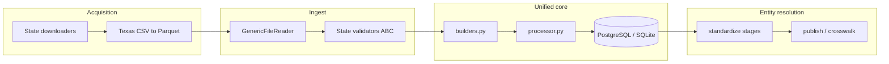
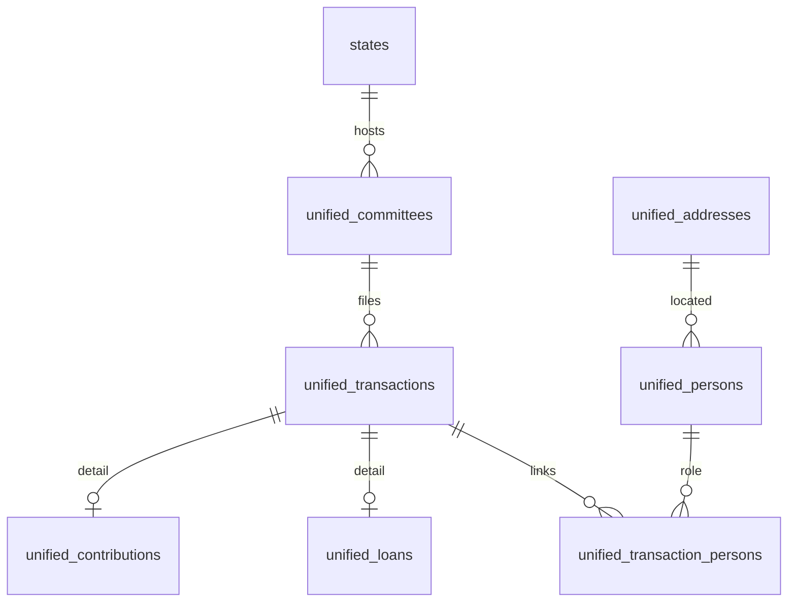

# Architecture diagram (post Wave 3 split)

## Pipeline component flow

## Unified schema (core tables)

## Module map (`app/core/`)

| Module | Purpose |
|--------|---------|
| `enums.py` | Shared enumerations (`TransactionType`, `PersonRole`, …) |
| `constants.py` | Record-type codes, amount buckets, placeholder names |
| `models/tables.py` | SQLModel table definitions |
| `builders.py` | State record → unified entity builders |
| `processor.py` | Orchestrates builders + detail registry |
| `value_objects.py` | Pure `PersonName`, `AddressParts`, `Officer` types |
| `unified_database.py` | Persistence, versioning, analysis queries |
