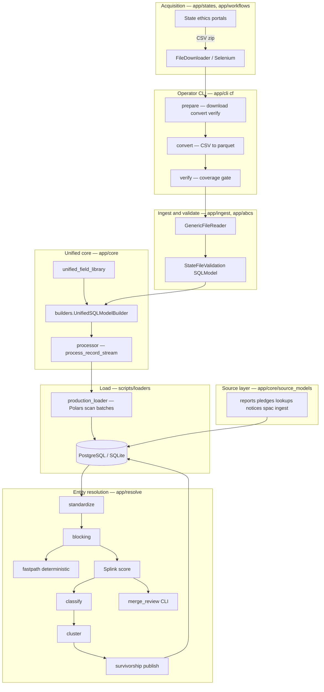
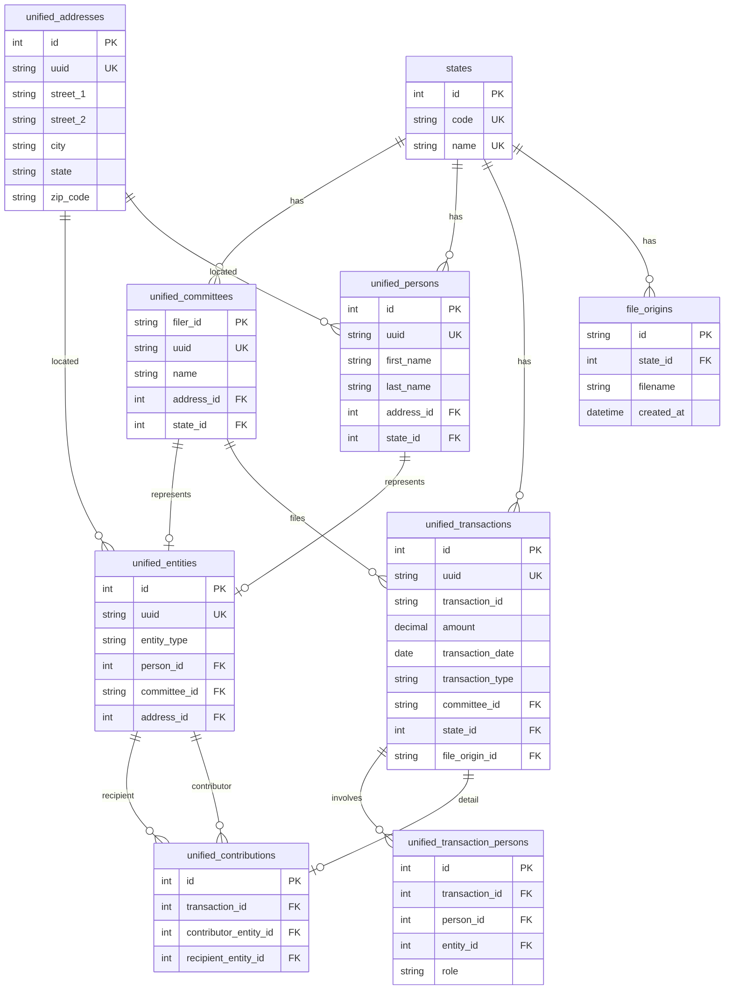

# Architecture diagram

Visual reference for the campaignfinance pipeline and the post–Wave-3 unified
core layout. For prose module descriptions see `docs/ARCHITECTURE.md`; for the
full multi-layer ERD (unified → resolution → canonical → publish views) see
`docs/DATA_RELATIONSHIPS.md`.

**Last updated:** 2026-05-25 (TASK-5d)

---

## End-to-end pipeline

### Stage summary

| Stage | Entry point | Output |
|-------|-------------|--------|
| Download | `uv run cf download texas` | Raw CSV under `tmp/{state}/` |
| Convert | `uv run cf convert texas` | Parquet (all-string schema, `infer_schema_length=0`) |
| Verify | `uv run cf verify texas` | Coverage table; non-zero exit if required types missing |
| Validate | State validators + `GenericFileReader` | Typed dicts / SQLModel rows per record |
| Unify | `UnifiedSQLModelBuilder` + `processor` | `UnifiedTransaction`, detail rows, entities |
| Load | `scripts/loaders/production_loader.py` | Rows in unified + source tables |
| Resolve | `uv run python -m app.resolve` | Canonical entities, crosswalks, publish views |

---

## Unified schema ERD (core tables)

Field names match `app/core/models/tables.py` (Wave-3 split). Detail tables
(`unified_loans`, `unified_debts`, …) hang off `unified_transactions` 1:1;
version tables omitted for clarity.

---

## Module map (`app/core/`)

| Module | Purpose |
|--------|---------|
| `enums.py` | Domain enumerations — `TransactionType`, `PersonRole`, `EntityType`, … |
| `constants.py` | `RECORD_TYPE_CODES`, `PLACEHOLDER_NAMES`, `AMOUNT_BUCKETS`, `MONEY_TYPE` |
| `models/tables.py` | SQLModel table definitions (unified + reference tables) |
| `builders.py` | State record → unified entity builders (`UnifiedSQLModelBuilder`) |
| `processor.py` | `DETAIL_BUILDERS` registry, `process_record` / `process_record_stream` |
| `value_objects.py` | Pure types — `PersonName`, `AddressParts`, `Officer` |
| `unified_field_library.py` | Cross-state field name → unified field mapping |
| `unified_database.py` | Sessions, persistence, versioning, analysis queries |
| `unified_state_loader.py` | State-record → unified-record orchestration |
| `source_models/` | Immutable source-layer ingest for reports, pledges, lookups, notices, SPAC |

See `app/core/README.md` for onboarding notes on the Wave-3 split modules.

---

## Related documents

- `docs/ARCHITECTURE.md` — narrative architecture and cross-cutting patterns
- `docs/DATA_RELATIONSHIPS.md` — full ERD including resolution and canonical layers
- `docs/adr/0002-data-classification-and-retention.md` — PII classification (R12)
- `docs/adr/0003-ai-governance-entity-resolution.md` — Splink governance (R3)
