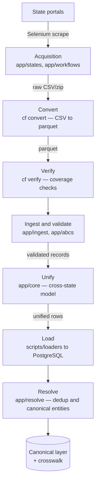

# Architecture

How `campaignfinance` is put together: the pipeline stages, the modules that
own each stage, and the cross-cutting patterns. Code is the source of truth — if
this document and the code disagree, the code wins and this file should be
updated.

## What the system does

The project aggregates US state campaign-finance data (donations, expenditures,
filers, committees) from many state portals into one unified, deduplicated,
cross-state data model. Each state publishes data in its own format; the system
normalizes those into a shared schema and then resolves real-world entities
(people, organizations, committees) across states and filings.

## Pipeline overview

The `cf` CLI (`app/cli/`) is the operator entry point for the left half of the
pipeline; `cf download / convert / verify / prepare <state>` drive acquisition
through verification.

## Modules

### Acquisition — `app/states/`, `app/workflows/`

State-specific downloaders under `app/states/{texas,oklahoma,ohio}/` scrape the
state ethics/finance portals with Selenium. Texas (the Texas Ethics Commission)
is the most complete; `app/workflows/texas_download.py` wraps its download flow.
Each state plugs into the abstract `FileDownloader` interface.

### Conversion & verification — `app/cli/`

`app/cli/` is a Typer application exposed as the `cf` console script. `convert.py`
turns downloaded CSVs into parquet (Texas conversion reads every column as a
string via `infer_schema_length=0` and skips the portal's metadata `.txt`
files). `verify.py` runs coverage checks; `prepare.py` chains download → convert
→ verify for a state.

### Ingestion & validation — `app/ingest/`, `app/abcs/`

`app/ingest/` holds the schema-driven `GenericFileReader`, which normalizes
headers and converts types as it streams records. `app/abcs/` defines the
project's Abstract Base Class layer — `StateConfig`, `StateCategoryClass`,
`StateFileValidation`, `FileDownloader`, `DBLoaderClass` — so a new state is
added by configuration and validators rather than by new bespoke code.
State-specific validators are SQLModel/Pydantic classes that each record passes
through before it is accepted.

### Unification — `app/core/`

`app/core/` is the cross-state heart. `unified_field_library.py` maps each
state's fields onto the shared schema; `unified_models.py` / `unified_sqlmodels.py`
define the unified records; `unified_state_loader.py` drives the
state-record → unified-record transformation; `unified_database.py` owns
sessions and persistence. `app/core/source_models/` holds the immutable
source-layer models for the secondary record types — reports, pledges, lookups,
notices, and SPAC links — each with a paired `*_ingest.py`.

### Loading — `scripts/loaders/`

`production_loader.py` loads unified records into PostgreSQL (SQLite is used for
development). `file_discovery.py` and `loader_config.py` handle input globbing
and tunable load presets (development, testing, production, high_performance,
safe).

### Entity resolution — `app/resolve/`

`app/resolve/` is the deduplication / entity-resolution pipeline that runs after
load. The flow is: `standardize/` (canonicalize names, addresses, orgs,
phonetics) → `blocking.py` (group plausibly-matching records) → `stages/`
(`classify`, `fastpath` for deterministic matches, `score` / `splink_scorer`
for probabilistic matching via Splink, `cluster` for connected components,
`survivorship` to build golden records). `models/` defines the `canonical` and
`resolution` schemas; `splink_config/` holds the Splink model settings.
`cli.py` / `run.py` / `__main__.py` are its entry points.

## Resolve canonical publish (Stage 7)

Survivorship publishes golden records by **delete-and-replace** on live canonical
tables (`_clear_live_canonical_snapshot` in `app/resolve/stages/survivorship.py`):

1. Delete `canonical_name_history`, `canonical_campaign`, `canonical_entity`.
2. Insert fresh rows for the completed run.
3. Preserve per-run provenance in `entity_crosswalk` keyed by `run_id`.

Failed runs roll back before Stage 7 commits; prior canonical data remains
serving. There is no per-run `staging_run_*` table swap.

## Cross-cutting patterns

- **ABC + configuration** — new states are onboarded through `StateConfig` and
  validators, not new pipeline code (`app/abcs/`).
- **Dependency injection** — the `inject` library wires sessions and services.
- **Schema-driven ingestion** — `GenericFileReader` works from a generated
  schema so header drift is handled centrally.
- **Secrets** — production secrets resolve through the 1Password Environments
  SDK (`onepassword-sdk`, `app/op.py`); local dev uses a gitignored `.env`.
- **Logging** — the `Logger` class ships logs to PaperTrail; never `print()`.
- **Lazy data** — Polars `LazyFrame`s are kept lazy; `.collect()` is deferred to
  the end of a transformation chain.

## Storage

| Layer | Engine | Notes |
|-------|--------|-------|
| Development | SQLite (`campaignfinance_dev.db`) | Local iteration |
| Production | PostgreSQL | Loaded by `scripts/loaders/production_loader.py` |
| Canonical / crosswalk | PostgreSQL | Output of `app/resolve/` |

## Related documents

- `docs/GUARDRAILS.md` — safety constraints and escalation rules
- `docs/TESTING.md` — test strategy and how to run the suite
- `docs/DEPLOYMENTS.md` — environments and rollout
- `docs/GITBUTLER.md` — branch workflow
- `docs/adr/` — recorded architecture / tooling decisions (including data classification and Splink governance)
- `docs/superpowers/specs/2026-05-23-data-resolution-pipeline-design.md` — the
  full design spec for the `app/resolve/` entity-resolution pipeline
