# DATA_RELATIONSHIPS.md
# Campaign Finance — Data Relationships & ERD
# Last Updated: 2026-05-25

This document describes the relationships between all tables in the campaign
finance database, from raw source data through the unified layer to the
canonical / resolution layer.

---

## Data-Flow Overview

```
State portal data
        │
        ▼
  [Source / Ingest]
   tmp/{state}/*.parquet
        │
        ▼
  [Unified Layer]            ← cross-state normalised records
   unified_transactions
   unified_contributions
   unified_entities
   unified_addresses
   unified_committees
   unified_persons
   …
        │
        ▼
  [Resolution Pipeline]      ← Phase 0-3: scoring, clustering, survivorship
   match_run
   resolution_input
   candidate_pair
   merge_edge / scored_pair
   match_decision
   merge_review
        │
        ▼
  [Canonical Layer]          ← de-duplicated master reference
   canonical_address
   canonical_entity
   canonical_campaign
   canonical_name_history
   entity_crosswalk
   address_crosswalk
   campaign_crosswalk
   resolution_audit_log
        │
        ▼
  [Publish Views]            ← pre-joined analytics surfaces
   resolved_transactions
   resolved_contributions
   resolved_expenditures
   address_occupancy
```

---

## ERD — Full Schema

```mermaid
erDiagram

    %% ─────────────────────────────────────────────
    %% UNIFIED SOURCE LAYER
    %% ─────────────────────────────────────────────

    states {
        int     id PK
        string  code
        string  name
    }

    file_origins {
        string   id PK
        int      state_id FK
        string   filename
        datetime created_at
    }

    unified_committees {
        string filer_id PK
        string uuid
        string name
        int    address_id FK
        int    state_id FK
    }

    unified_addresses {
        int    id PK
        string uuid
        string street_1
        string street_2
        string city
        string state
        string zip_code
    }

    unified_persons {
        int    id PK
        string uuid
        string first_name
        string last_name
        string middle_name
        string suffix
        int    address_id FK
        int    state_id FK
    }

    unified_entities {
        int    id PK
        string uuid
        string entity_type
        int    person_id FK
        string committee_id FK
        int    address_id FK
        int    state_id FK
    }

    unified_transactions {
        int     id PK
        string  uuid
        string  transaction_id
        numeric amount
        date    transaction_date
        string  transaction_type
        int     state_id FK
        string  committee_id FK
        string  file_origin_id FK
        int     report_id FK
        string  report_ident
    }

    unified_contributions {
        int     id PK
        int     transaction_id FK
        int     contributor_entity_id FK
        int     recipient_entity_id FK
        numeric amount
    }

    unified_loans {
        int     id PK
        int     transaction_id FK
        int     lender_entity_id FK
        int     borrower_entity_id FK
    }

    unified_debts {
        int     id PK
        int     transaction_id FK
        int     creditor_entity_id FK
        int     debtor_entity_id FK
    }

    unified_transaction_persons {
        int    id PK
        int    transaction_id FK
        int    person_id FK
        int    entity_id FK
        string role
    }

    states ||--o{ file_origins : "has"
    states ||--o{ unified_transactions : "has"
    states ||--o{ unified_persons : "has"
    states ||--o{ unified_committees : "has"
    unified_addresses ||--o{ unified_persons : "located"
    unified_addresses ||--o{ unified_entities : "located"
    unified_committees ||--o{ unified_transactions : "committee"
    unified_persons ||--o| unified_entities : "represents"
    unified_committees ||--o| unified_entities : "represents"
    unified_entities ||--o{ unified_contributions : "contributor"
    unified_entities ||--o{ unified_contributions : "recipient"
    unified_transactions ||--o| unified_contributions : "detail"
    unified_transactions ||--o| unified_loans : "detail"
    unified_transactions ||--o| unified_debts : "detail"
    unified_transactions ||--o{ unified_transaction_persons : "involves"

    %% ─────────────────────────────────────────────
    %% RESOLUTION PIPELINE LAYER
    %% ─────────────────────────────────────────────

    match_run {
        int      id PK
        string   state_code
        string   pass_type
        string   status
        datetime created_at
        datetime completed_at
        json     config_json
    }

    resolution_input {
        int    id PK
        int    run_id FK
        string source_type
        string source_id
        string canonical_name
        string state_code
        string entity_type
    }

    candidate_pair {
        int    id PK
        int    run_id FK
        string source_type
        string source_id_a
        string source_id_b
        string blocking_key
    }

    scored_pair {
        int   id PK
        int   run_id FK
        int   pair_id FK
        float score
        json  explanation_json
    }

    match_decision {
        int    id PK
        int    run_id FK
        string source_type
        string source_id_a
        string source_id_b
        string decision
        string match_method
    }

    merge_review {
        int      id PK
        int      run_id FK
        string   source_a_type
        string   source_a_id
        string   source_b_type
        string   source_b_id
        float    score
        json     explanation_json
        string   status
        string   reviewer_id
        string   reviewer_notes
        datetime reviewed_at
    }

    match_run ||--o{ resolution_input : "contains"
    match_run ||--o{ candidate_pair : "generates"
    match_run ||--o{ match_decision : "produces"
    match_run ||--o{ merge_review : "queues"
    candidate_pair ||--o| scored_pair : "scored as"

    %% ─────────────────────────────────────────────
    %% CANONICAL LAYER  (resolution output)
    %% ─────────────────────────────────────────────

    canonical_address {
        int    id PK
        string uuid
        string standardized_line_1
        string standardized_line_2
        string city
        string state
        string zip5
        string zip4
        int    frequency
    }

    canonical_entity {
        int    id PK
        string uuid
        string canonical_name
        string entity_type
        int    canonical_address_id FK
        int    master_entity_id FK
        date   first_seen_date
        date   last_seen_date
    }

    canonical_campaign {
        int    id PK
        string uuid
        string canonical_name
        string office
        string state_code
        int    canonical_entity_id FK
        date   first_seen_date
        date   last_seen_date
    }

    canonical_name_history {
        int    id PK
        int    canonical_entity_id FK
        string name_variant
        date   first_seen_date
        date   last_seen_date
        string source_type
    }

    entity_crosswalk {
        int    id PK
        string source_type
        string source_id
        int    canonical_entity_id FK
        int    run_id FK
        string match_method
    }

    address_crosswalk {
        int    id PK
        string source_type
        string source_id
        int    canonical_address_id FK
        int    run_id FK
    }

    campaign_crosswalk {
        int    id PK
        string source_type
        string source_id
        int    canonical_campaign_id FK
        int    run_id FK
    }

    canonical_address ||--o{ canonical_entity : "home to"
    canonical_entity ||--o| canonical_entity : "master_entity_id (self-FK)"
    canonical_entity ||--o{ canonical_campaign : "ran"
    canonical_entity ||--o{ canonical_name_history : "name variants"
    canonical_entity ||--o{ entity_crosswalk : "mapped by"
    canonical_address ||--o{ address_crosswalk : "mapped by"
    canonical_campaign ||--o{ campaign_crosswalk : "mapped by"
    match_run ||--o{ entity_crosswalk : "produced"
    match_run ||--o{ address_crosswalk : "produced"
    match_run ||--o{ campaign_crosswalk : "produced"

    %% ─────────────────────────────────────────────
    %% PUBLISH VIEWS (analytics layer)
    %% ─────────────────────────────────────────────

    resolved_contributions {
        int     id
        int     transaction_id
        int     contributor_entity_id
        int     contributor_canonical_entity_id
        string  contributor_canonical_name
        int     recipient_entity_id
        int     recipient_canonical_entity_id
        string  recipient_canonical_name
        numeric amount
    }

    resolved_transactions {
        int    id
        string transaction_type
        int    contributor_canonical_entity_id
        string contributor_canonical_name
        int    recipient_canonical_entity_id
        string recipient_canonical_name
        int    payee_canonical_entity_id
        string payee_canonical_name
    }

    resolved_expenditures {
        int    id
        string transaction_type
        int    payee_canonical_entity_id
        string payee_canonical_name
    }

    address_occupancy {
        int    canonical_address_id
        string standardized_line_1
        string city
        string state
        string zip5
        int    canonical_entity_id
        string entity_name
        string entity_type
        string role
        int    transaction_count
        date   first_seen_date
        date   last_seen_date
    }

    canonical_entity }o--o{ resolved_contributions : "contributor/recipient"
    canonical_entity }o--o{ resolved_transactions : "contributor/recipient/payee"
    canonical_entity }o--o{ resolved_expenditures : "payee"
    canonical_entity }o--o{ address_occupancy : "occupies"
    canonical_address }o--o{ address_occupancy : "at"
```



---

## Canonical Layer — Table Notes

### `canonical_address`
One row per unique real-world postal address.  `frequency` counts how many
distinct source-layer records reference this address.  Used by the
`address_occupancy` view to surface shared-address relationships.

### `canonical_entity`
One row per unique real-world person, organisation, or committee.  The
`master_entity_id` self-foreign-key is reserved for cross-state linking
(future phase).  `canonical_address_id` points to the entity's primary
known address.

### `canonical_campaign`
One row per campaign (candidate + office + cycle).  Linked to the political
entity that ran the campaign via `canonical_entity_id`.

### `canonical_name_history`
Append-only log of name variants observed for a canonical entity.  Supports
audit queries such as "what names has this entity used?".

### `entity_crosswalk` / `address_crosswalk` / `campaign_crosswalk`
Mapping tables that record which source-layer ID was merged into which
canonical row, and by which resolution run and method.  Required for
reversibility (`unmerge` subcommand).

---

## Publish Views — Notes

### `resolved_contributions`
View over `unified_contributions` joined to `entity_crosswalk` and
`canonical_entity` for both the contributor and recipient.  Each row from
`unified_contributions` appears exactly once; canonical columns are `NULL`
when no crosswalk entry exists.

### `resolved_transactions`
View over `unified_transactions` joined to canonical entities for
contributor, recipient, and payee roles (via `unified_transaction_persons`).

### `resolved_expenditures`
Filtered subset of `resolved_transactions` where `transaction_type =
'expenditure'`, joining only the payee entity.

### `address_occupancy`
Per-entity-per-address analytics view.  Shows every canonical entity linked
to a canonical address, their role (resident for persons, registered for
orgs/committees), and the count of transactions they appear in.  Useful for
detecting address-sharing patterns indicative of related entities.

---

## Source → Resolution → Canonical Data Flow

```
unified_entities (source)
        │
        │  [Stage 1] build_resolution_input
        ▼
resolution_input
        │
        │  [Stage 2] blocking
        ▼
candidate_pair
        │
        │  [Stage 3] fast-path deterministic match
        ├──────────────────────────────────────────► match_decision (exact/rule)
        │
        │  [Stage 4] Splink scoring
        ▼
scored_pair
        │
        │  [Stage 5] classify (band thresholds)
        ▼
match_decision (probabilistic)
        │
        │  [Stage 6] connected-components clustering
        ▼
ClusterAssignment
        │
        │  [Stage 7] survivorship + publish
        ▼
canonical_entity + entity_crosswalk
        │
        │  [Phase 4] publish views
        ▼
resolved_contributions / resolved_transactions /
resolved_expenditures / address_occupancy
```
