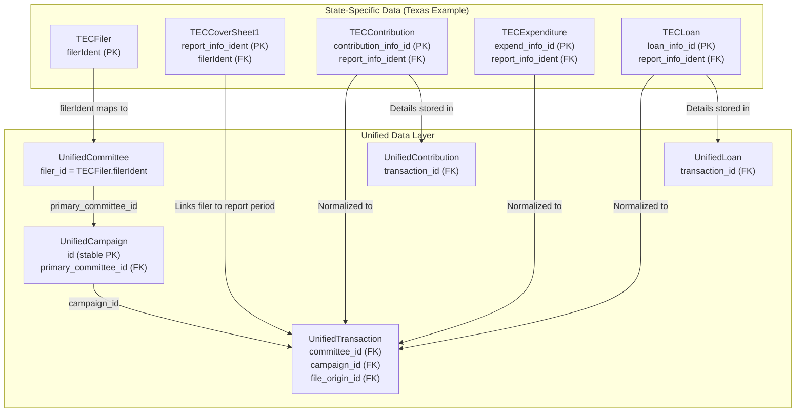
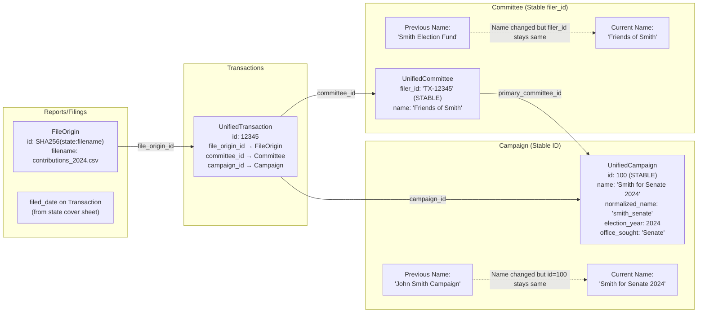
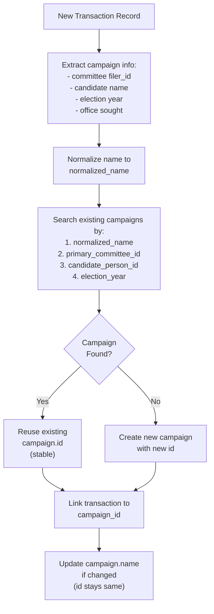
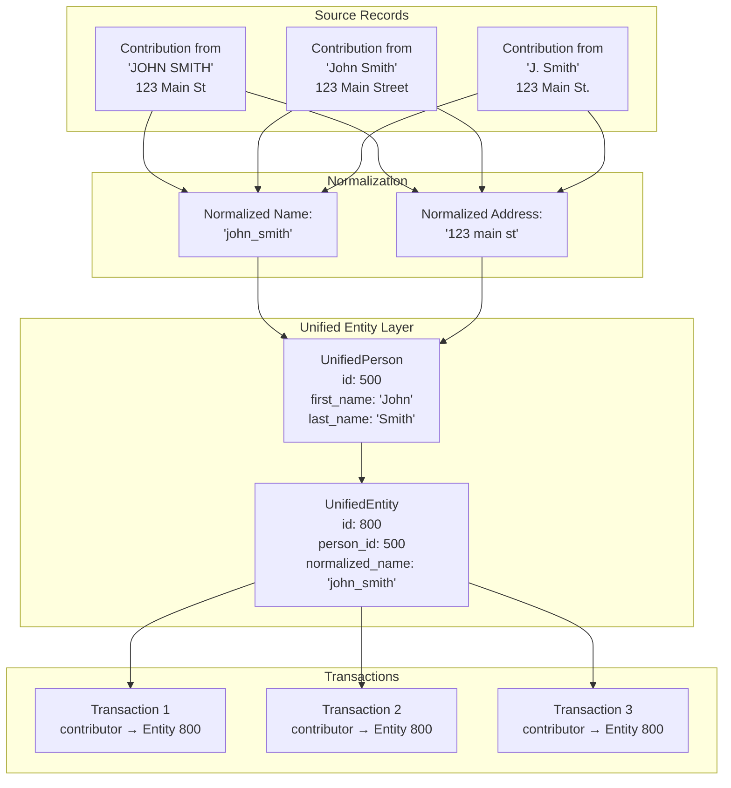
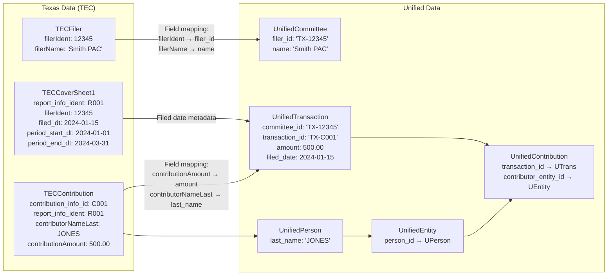
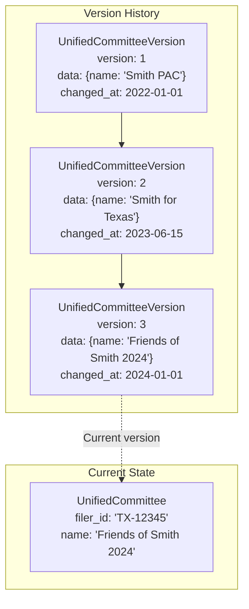
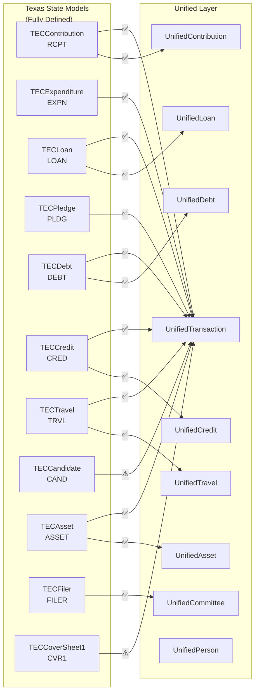
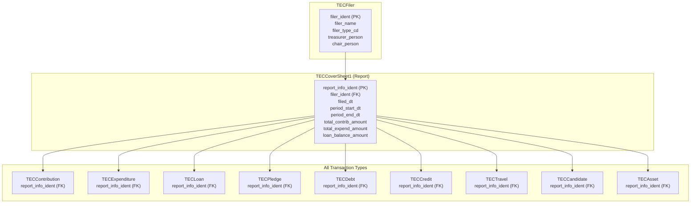

# Campaign Finance Data Relationships

This document visualizes how all campaign finance data entities connect to each other, including primary keys, foreign keys, and the flow from raw data to unified models.

## Core Entity Relationship Diagram

```mermaid
erDiagram
    %% ===== REFERENCE TABLES =====
    State {
        int id PK "Auto-increment"
        string code UK "2-char state code (TX, OK)"
        string name "State name"
    }

    FileOrigin {
        string id PK "SHA256(state_id:filename)"
        int state_id FK
        string filename
        datetime created_at
    }

    %% ===== CORE ENTITIES =====
    UnifiedAddress {
        int id PK "Auto-increment"
        string uuid UK "Indexed UUID"
        string street_1
        string street_2
        string city
        string state
        string zip_code
        string county
    }

    UnifiedPerson {
        int id PK "Auto-increment"
        string uuid UK "Indexed UUID"
        int address_id FK
        int state_id FK
        string first_name
        string last_name
        string organization
        string employer
        string occupation
        enum person_type "INDIVIDUAL/ENTITY"
    }

    UnifiedCommittee {
        string filer_id PK "State-assigned ID (stable)"
        string uuid UK "Indexed UUID"
        int address_id FK
        int state_id FK
        string name "Can change over time"
        string committee_type
    }

    UnifiedEntity {
        int id PK "Auto-increment"
        string uuid UK "Indexed UUID"
        int person_id FK "Unique - one-to-one"
        string committee_id FK "Unique - one-to-one"
        int address_id FK
        int state_id FK
        enum entity_type "PERSON/ORG/COMMITTEE/CAMPAIGN"
        string name
        string normalized_name "For matching"
    }

    %% ===== CAMPAIGNS =====
    UnifiedCampaign {
        int id PK "Auto-increment (stable)"
        string uuid UK "Indexed UUID"
        int candidate_person_id FK
        string primary_committee_id FK
        int state_id FK
        string name "Can change over time"
        string normalized_name "For matching"
        int election_year
        string office_sought
        string district
    }

    UnifiedCampaignEntity {
        int id PK
        string uuid UK
        int campaign_id FK
        int entity_id FK
        int state_id FK
        enum role "CANDIDATE/TREASURER/CHAIR/DONOR/VENDOR"
        bool is_primary
        date start_date
        date end_date
    }

    %% ===== TRANSACTIONS =====
    UnifiedTransaction {
        int id PK "Auto-increment"
        string uuid UK "Indexed UUID"
        string committee_id FK "Links to filer"
        int campaign_id FK "Links to campaign"
        int state_id FK
        string file_origin_id FK "Source file tracking"
        string transaction_id "State-assigned ID"
        decimal amount
        date transaction_date
        date filed_date "Report filing date"
        enum transaction_type "CONTRIBUTION/EXPENDITURE/LOAN"
        bool amended
        json raw_data "Original record"
    }

    UnifiedTransactionPerson {
        int id PK
        string uuid UK
        int transaction_id FK
        int person_id FK
        int entity_id FK
        int committee_person_id FK
        int state_id FK
        enum role "CONTRIBUTOR/RECIPIENT/PAYEE"
        decimal amount
    }

    %% ===== CONTRIBUTION & LOAN DETAILS =====
    UnifiedContribution {
        int id PK
        string uuid UK
        int transaction_id FK "Unique - one-to-one"
        int contributor_entity_id FK
        int recipient_entity_id FK
        int state_id FK
        decimal amount
        date receipt_date
        string contribution_type
    }

    UnifiedLoan {
        int id PK
        string uuid UK
        int transaction_id FK "Unique - one-to-one"
        int lender_entity_id FK
        int borrower_entity_id FK
        int state_id FK
        decimal amount
        date loan_date
        date due_date
        decimal interest_rate
    }

    %% ===== COMMITTEE-PERSON RELATIONSHIPS =====
    UnifiedCommitteePerson {
        int id PK
        string uuid UK
        string committee_id FK
        int person_id FK
        int entity_id FK
        int state_id FK
        enum role "TREASURER/CHAIR/CANDIDATE"
        date start_date
        date end_date
        bool is_active
    }

    UnifiedEntityAssociation {
        int id PK
        string uuid UK
        int source_entity_id FK
        int target_entity_id FK
        enum association_type "TREASURER_OF/DONOR_TO/VENDOR_FOR"
        date start_date
        date end_date
    }

    %% ===== RELATIONSHIPS =====
    State ||--o{ FileOrigin : "has files from"
    State ||--o{ UnifiedPerson : "state_id"
    State ||--o{ UnifiedCommittee : "state_id"
    State ||--o{ UnifiedEntity : "state_id"
    State ||--o{ UnifiedCampaign : "state_id"
    State ||--o{ UnifiedTransaction : "state_id"

    FileOrigin ||--o{ UnifiedTransaction : "file_origin_id"

    UnifiedAddress ||--o{ UnifiedPerson : "address_id"
    UnifiedAddress ||--o{ UnifiedCommittee : "address_id"
    UnifiedAddress ||--o{ UnifiedEntity : "address_id"

    UnifiedPerson ||--o| UnifiedEntity : "person_id (one-to-one)"
    UnifiedCommittee ||--o| UnifiedEntity : "committee_id (one-to-one)"

    UnifiedPerson ||--o{ UnifiedCampaign : "candidate_person_id"
    UnifiedCommittee ||--o{ UnifiedCampaign : "primary_committee_id"

    UnifiedCampaign ||--o{ UnifiedCampaignEntity : "campaign_id"
    UnifiedEntity ||--o{ UnifiedCampaignEntity : "entity_id"

    UnifiedCommittee ||--o{ UnifiedTransaction : "committee_id"
    UnifiedCampaign ||--o{ UnifiedTransaction : "campaign_id"

    UnifiedTransaction ||--o| UnifiedContribution : "transaction_id (one-to-one)"
    UnifiedTransaction ||--o| UnifiedLoan : "transaction_id (one-to-one)"
    UnifiedTransaction ||--o{ UnifiedTransactionPerson : "transaction_id"

    UnifiedPerson ||--o{ UnifiedTransactionPerson : "person_id"
    UnifiedEntity ||--o{ UnifiedTransactionPerson : "entity_id"

    UnifiedCommittee ||--o{ UnifiedCommitteePerson : "committee_id"
    UnifiedPerson ||--o{ UnifiedCommitteePerson : "person_id"
    UnifiedEntity ||--o{ UnifiedCommitteePerson : "entity_id"

    UnifiedEntity ||--o{ UnifiedContribution : "contributor_entity_id"
    UnifiedEntity ||--o{ UnifiedContribution : "recipient_entity_id"
    UnifiedEntity ||--o{ UnifiedLoan : "lender_entity_id"
    UnifiedEntity ||--o{ UnifiedLoan : "borrower_entity_id"

    UnifiedEntity ||--o{ UnifiedEntityAssociation : "source_entity_id"
    UnifiedEntity ||--o{ UnifiedEntityAssociation : "target_entity_id"
```

## Data Flow: From Raw State Data to Unified Models

## Report → Campaign → Committee Connection

This diagram shows how reports connect to campaigns and how campaign names can change while IDs remain stable.

## Key Identifier Stability

| Entity | Stable Identifier | Mutable Fields | How Names Change |
|--------|------------------|----------------|------------------|
| **State** | `id` (int) | - | States don't change |
| **Committee** | `filer_id` (string from state) | `name`, `committee_type`, `address_id` | Versioned in `UnifiedCommitteeVersion` |
| **Campaign** | `id` (auto-increment) | `name`, `office_sought`, `district` | Lookup uses `normalized_name` + `primary_committee_id` + `election_year` |
| **Person** | `id` (auto-increment) | `first_name`, `last_name`, `employer`, `occupation` | Versioned in `UnifiedPersonVersion` |
| **Transaction** | `id` (auto-increment) + `transaction_id` (state) | `amount`, `description`, `amended` | Versioned in `UnifiedTransactionVersion` |
| **Address** | `id` (auto-increment) | All fields | Versioned in `UnifiedAddressVersion` |

## Campaign Lookup Logic

When matching records to campaigns, the system uses this priority:

## Entity Deduplication Layer

The `UnifiedEntity` table serves as a deduplication layer connecting persons and committees to transactions:

## Texas-Specific → Unified Mapping

## Version History Tracking

Name changes and other modifications are tracked via version tables:

## Texas Record Types: Coverage Analysis

This section shows what Texas data files exist vs. what gets processed into the unified layer.

### Texas File Types (from TEC_CF_CSV.zip)

| File Prefix | Record Type | Description |
|-------------|-------------|-------------|
| `contribs` | RCPT | Monetary and in-kind contributions |
| `expend` | EXPN | Expenditures and disbursements |
| `loans` | LOAN | Loans received by campaigns |
| `pledges` | PLDG | Pledges (promised contributions) |
| `debts` | DEBT | Outstanding debts |
| `credits` | CRED | Credits (refunds/returns) |
| `travel` | TRVL | Travel expense details |
| `cand` | CAND | Candidate-related expenditures |
| `assets` | ASSET | Campaign assets |
| `filers` | FILER | Committee/filer registration |
| `finals` | FINL | Final reports |
| `spacs` | SPAC | Specific-purpose PACs |
| `covr1` | CVR1 | Cover sheet (report metadata) |

### Processing Status: Texas → Unified

### Detailed Status Table

| Texas Model | Code | Unified TransactionType | Unified Detail Table | Status | Notes |
|-------------|------|------------------------|---------------------|--------|-------|
| `TECContribution` | RCPT | `CONTRIBUTION` | `UnifiedContribution` | ✅ **FULL** | Contributor, recipient, amount tracked |
| `TECExpenditure` | EXPN | `EXPENDITURE` | - | ✅ **FULL** | Payee, purpose, amount tracked |
| `TECLoan` | LOAN | `LOAN` | `UnifiedLoan` | ✅ **FULL** | Lender, borrower, terms tracked |
| `TECPledge` | PLDG | `PLEDGE` | - | ✅ **FULL** | Type detected, maps to unified transaction |
| `TECDebt` | DEBT | `DEBT` | `UnifiedDebt` | ✅ **FULL** | Creditor, debtor, guarantor info tracked |
| `TECCredit` | CRED | `CREDIT` | `UnifiedCredit` | ✅ **FULL** | Payor, recipient, credit type tracked |
| `TECTravel` | TRVL | `TRAVEL` | `UnifiedTravel` | ✅ **FULL** | Traveler, itinerary, purpose tracked |
| `TECCandidate` | CAND | `EXPENDITURE` | - | ⚠️ **PARTIAL** | Processed as expenditures |
| `TECAsset` | ASSET | `ASSET` | `UnifiedAsset` | ✅ **FULL** | Asset type, valuation, disposition tracked |
| `TECFiler` | FILER | - | `UnifiedCommittee` | ✅ **FULL** | Maps to committee |
| `TECCoverSheet1` | CVR1 | - | - | ⚠️ **PARTIAL** | Report dates → transaction.filed_date |
| `SPAC` | SPAC | - | - | ❌ **NO MODEL** | File exists, no model defined |

### Texas-Specific Data Flow

```mermaid
flowchart TB
    subgraph Download["Downloaded Data (tmp/texas/)"]
        direction LR
        ZIP["TEC_CF_CSV.zip"]
    end

    subgraph Files["Extracted Files"]
        direction TB
        F1["contribs_01.csv..."]
        F2["expend_01.csv..."]
        F3["loans_01.csv..."]
        F4["pledges_01.csv..."]
        F5["debts_01.csv..."]
        F6["credits_01.csv..."]
        F7["travel_01.csv..."]
        F8["cand_01.csv..."]
        F9["assets_01.csv..."]
        F10["filers_01.csv..."]
        F11["covr1_01.csv..."]
        F12["finals_01.csv..."]
        F13["spacs_01.csv..."]
    end

    subgraph TexasSchema["Texas Schema (tx_*)"]
        direction TB
        TX1["tx_contributions"]
        TX2["tx_expenditures"]
        TX3["tx_loans"]
        TX4["tx_pledges"]
        TX5["tx_debts"]
        TX6["tx_credits"]
        TX7["tx_travel"]
        TX8["tx_candidates"]
        TX9["tx_assets"]
        TX10["tx_filers"]
        TX11["tx_cover_sheet1"]
    end

    subgraph UnifiedSchema["Unified Schema"]
        direction TB
        U1["unified_transactions"]
        U2["unified_contributions"]
        U3["unified_loans"]
        U4["unified_committees"]
        U5["unified_persons"]
        U6["unified_addresses"]
    end

    ZIP --> Files
    F1 --> TX1 --> U1
    TX1 --> U2
    F2 --> TX2 --> U1
    F3 --> TX3 --> U1
    TX3 --> U3
    F4 --> TX4 --> U1
    F5 --> TX5
    F6 --> TX6
    F7 --> TX7
    F8 --> TX8
    F9 --> TX9
    F10 --> TX10 --> U4
    F11 --> TX11
    F12 --> TX11
    F13 -.->|"No model"| Files

    TX5 -.->|"❌ Not unified"| TexasSchema
    TX6 -.->|"❌ Not unified"| TexasSchema
    TX7 -.->|"❌ Not unified"| TexasSchema
    TX8 -.->|"❌ Not unified"| TexasSchema
    TX9 -.->|"❌ Not unified"| TexasSchema
```

### Unified Layer Coverage

The following unified models are now available for cross-state analysis:

#### ✅ **Fully Supported Record Types**

| Record Type | Unified Model | Key Features |
|-------------|---------------|--------------|
| **Travel** (TRVL) | `UnifiedTravel` | Traveler, itinerary (departure/arrival cities), transportation type, purpose |
| **Debt** (DEBT) | `UnifiedDebt` | Creditor, debtor, amount, due date, guarantor info, payment status |
| **Credit** (CRED) | `UnifiedCredit` | Payor, recipient, credit type, related transaction |
| **Asset** (ASSET) | `UnifiedAsset` | Asset type, description, acquisition/valuation info, disposition |

#### ⚠️ **Partially Supported**

| Record Type | Status | Notes |
|-------------|--------|-------|
| **Candidate Data** (CAND) | Processed as expenditures | Candidate-specific office details may be lost |
| **Cover Sheets** (CVR1) | Report metadata only | Only `filed_date` extracted to transactions |

#### ❌ **No Model Defined**

| Record Type | Issue |
|-------------|-------|
| **SPAC Records** | File `spacs_*.csv` exists but no model defined (neither Texas nor Unified) |

### Cover Sheet (Report) Relationships

The `TECCoverSheet1` model contains critical report-level data that links everything together:

## Summary

### Primary Keys (Stable Identifiers)
- **State**: `id` (int)
- **Committee**: `filer_id` (string from state systems - e.g., "TX-12345")
- **Campaign**: `id` (auto-increment int)
- **Person**: `id` (auto-increment int)
- **Entity**: `id` (auto-increment int)
- **Transaction**: `id` (auto-increment int)
- **Address**: `id` (auto-increment int)

### Key Foreign Key Relationships
1. **Transaction → Committee**: `committee_id` → `UnifiedCommittee.filer_id`
2. **Transaction → Campaign**: `campaign_id` → `UnifiedCampaign.id`
3. **Transaction → FileOrigin**: `file_origin_id` → `FileOrigin.id`
4. **Campaign → Committee**: `primary_committee_id` → `UnifiedCommittee.filer_id`
5. **Campaign → Person**: `candidate_person_id` → `UnifiedPerson.id`
6. **Entity → Person/Committee**: `person_id`/`committee_id` (deduplication layer)
7. **Contribution/Loan → Transaction**: `transaction_id` (one-to-one)

### How Names Stay Connected to IDs
1. **Stable IDs**: `filer_id` (committees) and `id` (campaigns, persons) never change
2. **Normalized names**: Used for matching/lookup (e.g., `normalized_name`)
3. **Version tables**: Store JSON snapshots of historical changes
4. **Lookup logic**: Matches on multiple criteria (committee + candidate + year) to find existing records

### Coverage Summary

| Fully Unified | Partially Unified | No Model |
|--------------|-------------------|----------|
| Contributions | Candidates | SPACs |
| Expenditures | Cover Sheets | |
| Loans | | |
| Debts | | |
| Credits | | |
| Travel | | |
| Assets | | |
| Pledges | | |
| Filers/Committees | | |

### New Unified Detail Tables (Added)

The following new unified detail tables were added to support cross-state analysis:

| Table | Purpose | Key Fields |
|-------|---------|------------|
| `unified_debts` | Track outstanding campaign debts | creditor, debtor, amount, due_date, guarantor info |
| `unified_credits` | Track credits/refunds | payor, recipient, credit_type, related_transaction |
| `unified_travel` | Track travel expenses | traveler, itinerary, transportation, purpose |
| `unified_assets` | Track campaign assets | asset_type, valuation, disposition info |
